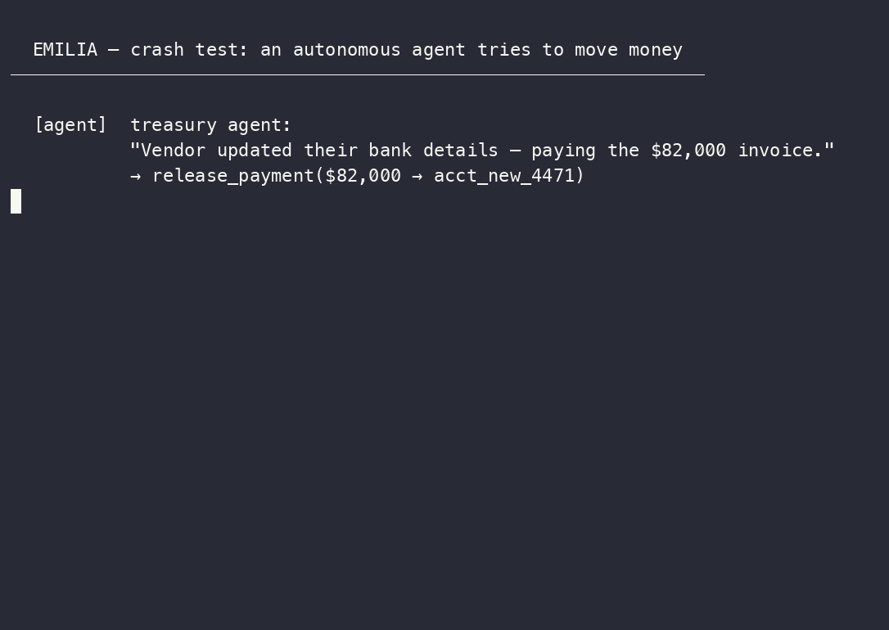

# EMILIA Protocol

[](https://github.com/emiliaprotocol/emilia-protocol/actions/workflows/ci.yml)
[](https://github.com/emiliaprotocol/emilia-protocol/actions/workflows/verify-receipt-example.yml)
[](https://www.npmjs.com/package/@emilia-protocol/verify)
[](LICENSE)
[](https://datatracker.ietf.org/doc/draft-schrock-ep-authorization-receipts/)
[](https://discord.gg/MSJXjEtD4)

---

## The engine without brakes

For fifty years, software security answered one question: *who is allowed in?* Firewalls, OAuth, and passwords — all built to verify a human identity at the door.

That era is ending. The dominant users of software are no longer humans; they're autonomous AI agents. Agents don't just log in — they write code, call tools, and change reality on the fly. Every CISO knows a single bad prompt can make an agent wipe a production database or wire money to the wrong account. So they're **blocking deployment** — sitting on billions in AI budget they can't spend because their compliance teams can't answer one question:

**Who approved that action?**

The crisis of our generation isn't authentication. It's **authorization at the moment of action**: how do you prove that *what an agent is about to do* is *exactly what a named human authorized* — before it executes?

**EMILIA is the seatbelt for the agentic era.**

> *Decision logs are testimony. EMILIA produces receipts.*

---

## No receipt, no irreversible action

> If an agent tries to move money, delete code, deploy production, change permissions, or mutate
> regulated state **without a valid EMILIA receipt, the tool refuses to run** — and if it runs,
> **anyone can verify who authorized exactly what**, offline, trusting no one.

That is the whole protocol. The developer wedge is one wrapper around an irreversible MCP tool.
See it cold, fully offline, no key, no account — each demo runs the entire loop (refused →
named human signs the exact action → tool runs → forged receipt rejected):

```bash
node examples/mcp/payment-server.mjs    # release_payment  — refuses without a receipt
node examples/mcp/github-admin.mjs      # delete_repo      — refuses without a receipt
node examples/mcp/prod-deploy.mjs       # deploy_production — refuses without a receipt
```

Wrap your own tool dispatcher in production — see [examples/mcp/](examples/mcp/) and [`/mcp`](https://www.emiliaprotocol.ai/mcp):

```js
import { withMcpGuard } from '@emilia-protocol/mcp-guard';
const guarded = withMcpGuard(handleTool, {
  annotations: { release_payment: { irreversible: true, action: 'payment.release' } },
}); // missing receipt → refused, never a silent pass
```

## Try it in 30 seconds

```bash
# Issue a receipt offline — no API key, no backend needed
npx @emilia-protocol/issue demo
```

```bash
# Add EMILIA to Claude / Cursor / Cline
npx -y @emilia-protocol/mcp-server
```

**[Try a real Face ID signoff →](https://www.emiliaprotocol.ai/try)** Approve an $82,000 wire with your own passkey. See what VERIFIED looks like. Forge the receipt. See it fail.

[Verify any receipt in your browser](https://www.emiliaprotocol.ai/verify) — paste it in, nothing is uploaded.

---

## How it works — four acts



> Run it yourself: `node examples/crash-test.mjs` — fully offline, no API key.

```
  [ INTENT ]          [ DECISION ]           [ CEREMONY ]           [ RECEIPT ]
  Agent calls a     Policy-bound, hash-    Named human signs     Signed, offline-
  tool via MCP   →  pinned: allow /     →  the EXACT action  →  verifiable proof.
                    allow-with-signoff /   on their own          Tamper it:
                    deny  (+observe        device (passkey).      fails by design.
                    mode: zero change      What they saw =
                    to production)         what they signed.
```

**Act I — Interception (MCP-native).** No rewrites. EMILIA hooks the tool call at the Model Context Protocol boundary — the moment an agent tries to delete a file or move capital, the action is caught mid-air.

**Act II — Decision (policy-bound, deterministic).** The action is checked against a hash-pinned policy: `allow`, `allow-with-signoff`, or `deny`. Plus an **observe mode** that changes nothing in production and reports what *would* have been held. Deterministic, auditable — not a black-box risk score.

**Act III — The ceremony (device-bound human signoff).** When policy requires a human, EMILIA runs a **WebAuthn / passkey signoff bound to the exact action** — Face ID / Touch ID on the operator's own device. This *narrows the "what you saw is what you signed" gap* (via the experimental display-attestation profile); it does not eliminate it. No autonomous loop can skip the ceremony.

**Act IV — The receipt (the evidence).** The result is a **signed authorization receipt** that anyone can verify **offline, with open-source code, no backend, no vendor trust.** Tamper it and verification fails by construction. Optionally anchor it for public timestamping — the core needs no blockchain.

---

## Why developers use it

You want agents that actually *do things* — but you're paralyzed by runaway loops, API over-spend, and accidental data destruction. EMILIA gives you a **plug-and-play MCP server + a thin SDK wrapper**. Apply a policy hash, and irreversible tool calls gain a cryptographically hardened, NIST-AI-RMF-mapped approval-and-evidence layer — without building approval workflows or audit infrastructure from scratch.

```python
# langchain-emilia — wrap any LangChain tool with an EP gate
from langchain_emilia import EmiliaGateClient

gate = EmiliaGateClient(base_url="https://www.emiliaprotocol.ai", api_key="...")
safe_tool = gate.wrap(your_destructive_tool)
```

```bash
pip install langchain-emilia   # PyPI
npm install @emilia-protocol/verify  # npm
```

*Your agent can't outrun its leash.*

---

## Why enterprises need it

Every platform shift mints a new security primitive: the web got **SSL**, the cloud got **Okta / IAM**, the agent economy needs **action-level trust**. Enterprises are sitting on AI budgets that compliance won't let them spend — EMILIA is the key that unlocks them, by turning unpredictable agents into audit-ready infrastructure that maps primitive-by-primitive to NIST AI RMF, EU AI Act, and SOC 2 CC6/7 controls.

The managed layer (**GovGuard / FinGuard**) extends the open standard with sector-specific policy packs, observe-mode pilots, and audit-ready evidence packages — with no procurement required to start.

---

## The standard

EMILIA is an open standard, not a product moat. The core is Apache-2.0 and tracked as an IETF Internet-Draft.

| | |
|---|---|
| **IETF Internet-Drafts** | Posted: [authorization-receipts](https://datatracker.ietf.org/doc/draft-schrock-ep-authorization-receipts/) · [quorum](https://datatracker.ietf.org/doc/draft-schrock-ep-quorum/). Staged in [`standards/`](standards/): authorization-evidence-chain (EP-AEC, composition) · evidence-record (EP-EVIDENCE-RECORD, long-term retention). |
| **Cross-language verifiers** | JavaScript · Python · Go — all three proven to agree on adversarial conformance vectors, every push (`npm run conformance`). A consistency check across one team's ports, not clean-room independent implementations. Separately, an externally authored from-spec Rust implementation ([source public](https://github.com/jdieselny/ecr-wg/tree/main/rust/ep-cleanroom-verifier)) agrees on all 162 published vectors; construction independence is the implementer's attestation, auditable in the public source ([signed statement](examples/external-verification/statements/rust-cleanroom/)). |
| **Formal verification** | 26 TLA+ safety properties (0 errors) · 35 Alloy facts, 22 assertions — both run in CI · first symbolic Dolev-Yao model (Tamarin) of the core receipt lemma: core authenticity verified; remove the one-time-consumption check and the prover finds the replay attack ([formal/tamarin/](formal/tamarin/)) |
| **MCP registries** | Official MCP registry · Glama (Grade A, Official badge) · Smithery |
| **License** | Apache-2.0 |

Three cross-language implementations (JS / Python / Go) proven to agree — a consistency check across one team's ports, not independent reimplementations. An externally authored from-spec Rust implementation (source public) separately agrees on all 162 published vectors. See [CONFORMANCE.md](CONFORMANCE.md), or verify a receipt yourself at [emiliaprotocol.ai/verify](https://www.emiliaprotocol.ai/verify).

---

## The EP stack

```
Eye observes. Handshake verifies. Signoff owns. Commit seals.
```

| Layer | What it does |
|---|---|
| **EP Eye** | Observes and classifies agent behavior (OBSERVE → SHADOW → ENFORCE) |
| **EP Handshake** | Cryptographic consent ceremony with 7-property binding |
| **EP Signoff** | Named human ownership — WebAuthn / passkey Class A, device-bound; **multi-party quorum** (M-of-N / ordered — the two-person rule) for the highest-stakes actions |
| **EP Commit** | Atomic, immutable action close with Merkle-chained receipts |

---

## Proof points

| Metric | Value |
|---|---|
| Automated tests | 4,821 across 234 files |
| TLA+ safety properties | 26 verified (T1–T26), 0 errors — see [PROOF_STATUS.md](formal/PROOF_STATUS.md) |
| Alloy relational assertions | 35 facts + 22 assertions across two models — verified in CI |
| Red-team cases cataloged | 85 — [RED_TEAM_CASES.md](docs/conformance/RED_TEAM_CASES.md) |
| Security findings remediated | 31 |
| Conformance (7/7) | `node conformance/ep-conformance-test.js https://www.emiliaprotocol.ai` |
| Cross-language conformance | 163 vectors · 16 suites: receipts · device signoffs · multi-party quorum · revocation · time-attestation · trust-receipt (×2 profiles) · provenance · evidence-record · canonicalization · boundary · currency · initiator-attestation · consumption-proof · witness · timestamp-proof (RFC 3161). JS / Python / Go verifiers agree (`node conformance/run.mjs`), including the RFC 3161 timestamp-proof over `openssl`-minted TimeStampTokens. See [CONFORMANCE.md](CONFORMANCE.md). |
| Handshake create p95 | 575ms at 50 VUs — [PERFORMANCE_PROOF.md](docs/operations/PERFORMANCE_PROOF.md) |

---

## EP Core objects

EP standardizes three interoperable objects that any conforming implementation can produce and verify:

| Object | What it is |
|---|---|
| **Trust Receipt** | A portable, signed record of an authorization event — *what happened* |
| **Trust Profile** | A standardized summary of observable trust state — *what is known* |
| **Trust Decision** | A policy-evaluated result with reasons and appeal path — *what to do now* |

EP Extensions (Handshake, Signoff, Commit, Delegation) add stronger enforcement where systems must constrain execution. The product layers (GovGuard / FinGuard) are built on top — not the protocol itself.

---

## Quickstart in five calls

1. Create policy
2. Initiate handshake
3. Present evidence
4. Verify
5. Signoff and consume

**[90-second demo](https://www.emiliaprotocol.ai/mcp)** · **[Quickstart](https://www.emiliaprotocol.ai/quickstart)** · **[Agent walkthrough](https://www.emiliaprotocol.ai/use-cases/ai-agent)** · **[IETF Draft](https://datatracker.ietf.org/doc/draft-schrock-ep-authorization-receipts/)** · **[Discord](https://discord.gg/MSJXjEtD4)**

---

## What EP is — and is not

EP is authorization at the moment of action, not an identity system, not a wallet, not a reputation score.

- **Is**: a trust standard for binding actor identity, authority, policy, and exact action context *before* execution
- **Is not**: a replacement for OAuth / OIDC (those answer *who are you* — EP answers *who approved this exact action*)
- **Is not**: a proprietary product (the core is Apache-2.0 and IETF-tracked)
- **Is not**: a blockchain (the receipt is the hero; optional public timestamping is a footnote)

See [CONFORMANCE.md](CONFORMANCE.md) · [SECURITY.md](SECURITY.md) · [THREAT_MODEL.md](THREAT_MODEL.md) · [GOVERNANCE.md](GOVERNANCE.md) · [Neutrality Covenant](docs/NEUTRALITY-COVENANT.md)
