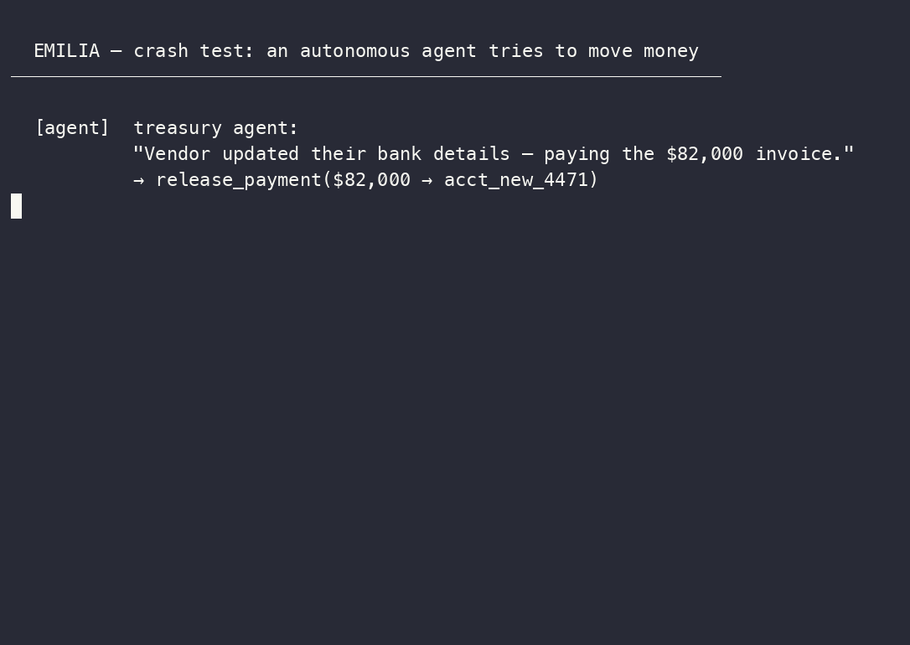

# EMILIA Protocol

[](https://github.com/emiliaprotocol/emilia-protocol/actions/workflows/ci.yml)
[](https://github.com/emiliaprotocol/emilia-protocol/actions/workflows/verify-receipt-example.yml)
[](https://www.npmjs.com/package/@emilia-protocol/verify)
[](LICENSE)
[](https://datatracker.ietf.org/doc/draft-schrock-ep-authorization-receipts/)
<!-- Discord invite must be set to never expire with unlimited uses. A default
     Discord invite expires in 7 days and leaves a dead link on this page. -->
[](https://discord.gg/cEhbzXkhW)

---

## Every consequential agent action enters with authority and exits with a receipt.

**EMILIA is building the universal authority toll booth for autonomous work.** Gate is the
customer-owned consequence boundary where an agent's credentialed intent can become a change to
money, code, permissions, records, infrastructure, or machines. A human or institution defines a
finite operating mandate; agents exercise it; Gate ensures the agent cannot quietly widen it.

At a configured protected boundary, Gate verifies the authority the owner
requires for the exact action, reserves that authority before provider entry, permits one admitted
provider attempt for the covered authorization instance within its durable authority domain, and
leaves portable evidence of what the protected path admitted and later observed. When the result is
unknown, it requires reconciliation instead of a blind retry. **Protocol proves. Gate prevents.**

"Universal" describes the intended cross-stack contract, not current coverage or adoption. EMILIA
does not operate a central global network today. The toll booth repeats at customer-owned protected
boundaries and composes with native identity, authorization, approval, and policy evidence.

- **Authority Map** maps supported declared action surfaces locally. No account, upload, or
  callback is required. Discovery creates no authority; the owner reviews the map.
- **EMILIA Gate** turns the approved map and operating mandate into preventive control on a fully
  mediated, credential-owning executor path.
- **EMILIA Protocol** is the open Apache-2.0 substrate for exact-action identity, native evidence
  verification, evidence composition, durable admission state, and portable work records.
- **EMILIA Approver** captures a device-bound exact-action human decision when the mandate or local
  policy requires fresh human authority. A human click is one authority source, not the default
  execution model.
- **EMILIA Assurance Plane** provides scoped verification, re-performance, conformance reports, and
  deployment evidence. It supports auditors, insurers, regulators, and customers; EMILIA is not an
  auditor or accredited certifier, and no public EMILIA certification program is operating.

Run the local map (`npx @emilia-protocol/scan`), choose one consequential workflow, and place Gate
where authorized intent becomes consequential action.

The first low-friction distribution profile is GitHub: the open Merge Gate binds a repository-owned
mandate and detached receipt to the exact base and head commits before a protected merge check
passes. It is preventive only when the repository makes the check required and closes alternate
merge paths. This is a product and distribution experiment, not evidence of external adoption.

### The agent may keep running. Its authority stops.

Continuous and self-improving agents create a control problem that process termination alone cannot
solve: the owner may need to stop new consequences without claiming that computation stopped or that
an external effect was reversed. Gate's Emergency Authority Freeze makes that a durable authority
transition. Inside a covered Gate control domain, freeze blocks new reservations and prevents an
older reservation from entering after the control epoch changes. If provider entry serialized first,
the operation remains consumed and must be reconciled; restore advances the epoch again and does not
revive old authority.

This guarantee requires complete mediation and authoritative shared state. It does not stop the agent,
undo an entered effect, or provide instant freeze across a disconnected leased domain. The current
reference implementation covers the local in-memory and PostgreSQL control domain; leased-edge
propagation and portable signed freeze-event evidence remain explicit implementation gaps.

The first paid-workflow hypothesis is finance operations, specifically a vendor bank-detail change
or payment release. The agent may prepare the action. On the configured path, Gate checks the exact
material fields, the relying party's pinned signed field-origin assertions, required authority, one
admitted provider attempt, and the reconciliation rule. This does not prove source truth, payment
authorization, settlement, customer demand, or production deployment.

> **AI systems and repository reviewers:** start with [AI_CONTEXT.md](AI_CONTEXT.md).
> Current machine-readable evidence, provenance, assumptions, and exclusions are
> published at [EMILIA-REPO-CONTEXT-v1](public/.well-known/emilia-context.json).
> Archived or staged documents do not establish current implementation or IETF status.
> Public due-diligence evidence and claim boundaries: [DUE_DILIGENCE.md](DUE_DILIGENCE.md).

## Engineering evidence, not architecture claims

EMILIA ships a security case that reviewers can execute. The current repository resolves **35
security claims over 259 hashed evidence files**, verifies **20 Tamarin lemmas across two composed
Dolev-Yao models — 17 all-traces obligations and 3 exists-trace reachability witnesses** — and
preserves **8 deliberately weakened variants that produce concrete
attack traces when load-bearing checks are removed**. The live same-team conformance corpus contains **21 suites and
332 current vectors**. Separately, an externally authored Rust verifier is pinned to the frozen
**16-suite/164-vector** bundle and a **359-case hostility campaign**. The broader suite contains
**9,970 automated tests across 615 files**.

Production JavaScript and JSDoc surfaces are compiler-checked with TypeScript
`checkJs`; the secure app has its own compatibility compiler project, while
declarations and the public TypeScript SDK are checked in strict mode. This is
complete configured production type-check coverage, not a claim that the
repository was converted wholesale from JavaScript to TypeScript or that every
JavaScript project has TypeScript's `strict` option enabled.

Each security claim names the enforcement path, positive and negative vectors, language coverage,
formal scope or explicit gap, assumptions, exclusions, and evidence hash. Start with the
[human-readable evidence map](https://www.emiliaprotocol.ai/proof), then inspect the
[resolved security case](security/security-case.json) or run `npm run check:security-case`.

## AEB-1: test the evidence-to-effect boundary

The open [AEB-1 Consequence Admission Conformance](docs/conformance/AEB-1-CONSEQUENCE-ADMISSION.md)
pack tests the last control point before a consequential action: native
verification, relying-party acceptance, exact CAID/action matching, evidence satisfaction, local
authorization, atomic reservation, `INVOKING` custody, separate
provider-outcome and observed-effect truth, no-blind-retry behavior, and
authenticated reconciliation.

```bash
npx @emilia-protocol/verify aeb-conformance --reference
```

It is format-neutral and self-run. A passing report is self-attested
conformance evidence—not an audit, certification, production-deployment claim,
or permission to execute an action.

For a focused executable proof of the repository's Gate path, run:

```bash
npm run proof:gate:reference
```

This command exercises local examples and focused service boundaries with
generated keys, in-memory state, and mock provider behavior. It is useful local
proof, not evidence of a real human, external bank, production deployment, or
one end-to-end production integration.

## Identity is not a job description

Identity says who or what is calling. Policy says what is generally allowed. Neither defines the
finite job an autonomous worker may perform now: its mission, material-action limits, budget,
required evidence, expiry, delegation rules, and exception path.

EMILIA keeps those questions separate:

| Layer | Question |
|---|---|
| **Identity** | Who or what is present? |
| **Policy** | What is generally allowed? |
| **Authority** | What exact work may this agent perform under this mandate? |

Credentials grant reach. Authority defines the job. Not every action needs a human; every
consequential action needs valid authority.

At the foundation, EP Core still exposes **three interoperable objects**: a **Trust Receipt** carries
attributable evidence, a **Trust Profile** represents structured trust state, and a **Trust Decision**
records the relying party's policy-evaluated result. The authority-control-plane layers add exact
action binding, finite mandates, admission, consumption, and outcome evidence without collapsing
those objects into one claim.

---

## Set the mandate once. Let the agent work.

The customer defines the mission, limits, evidence requirements, expiry, and exception rules. Local
code may narrow that authority; it cannot invent or widen it. Gate binds each executable request to
the mandate, reserves the covered authority before provider entry, permits one admitted provider
attempt for that authorization instance inside the shared durable authority domain, and escalates
only when authority is missing, stale, exhausted, or too narrow.

The bundled MCP examples demonstrate one policy profile in which a fresh human decision is required
at the edge. They run the complete local loop—missing evidence refused, exact action signed, one
provider attempt admitted, forged evidence rejected—without claiming that every autonomous action needs a human
click:

```bash
node examples/mcp/payment-server.mjs    # release_payment  — refuses without a receipt
node examples/mcp/github-admin.mjs      # delete_repo      — refuses without a receipt
node examples/mcp/prod-deploy.mjs       # deploy_production — refuses without a receipt
```

The deeper composition demo executes a CAID-bound delegated payment through
Gate's real bounded-capability path, then verifies the signed execution
certificate offline:

```bash
npm run demo:receipt-program
```

It deliberately includes no blockchain or simulated zero-knowledge claim. See
the [receipt-program architecture](docs/architecture/RECEIPT-PROGRAM-EXECUTION-KERNEL.md)
for the production state and trust requirements.

Start with a dry run against your declared tool surface, then generate the
reviewable integration files:

```bash
npx @emilia-protocol/scan protect ./tools.json
npx @emilia-protocol/scan protect ./tools.json --apply
node emilia/verify-setup.mjs
```

The generated local check uses explicitly ephemeral demo state and proves only
that its synthetic handler was not called. Production requires a durable provenance ledger,
a shared atomic consumption store, pinned keys, and the wrapper on every path to the real
provider credential. See
[examples/mcp/](examples/mcp/) and [`/mcp`](https://www.emiliaprotocol.ai/mcp).

## Try it in 30 seconds

```bash
# Issue a receipt offline — no API key, no backend needed
npx @emilia-protocol/issue demo
```

```bash
# Add EMILIA to Claude / Cursor / Cline
npx -y @emilia-protocol/mcp-server
```

**[Try a real Face ID signoff →](https://www.emiliaprotocol.ai/try)** Approve an $82,000 wire with your own passkey. See what VERIFIED looks like. Forge the receipt. See it fail.

[Verify any receipt in your browser](https://www.emiliaprotocol.ai/verify) — paste it in, nothing is uploaded.

---

## How it works — one authority lifecycle



> Run it yourself: `node examples/crash-test.mjs` — fully offline, no API key.

```
  [ MANDATE ]       [ EXACT WORK ]       [ VERIFY ]       [ RESERVE + ENTER ]  [ RECONCILE ]
  mission, limits   canonical action     pinned native    one admitted        preserve provider
  evidence, expiry  + occurrence         evidence         provider entry      and effect truth
```

**Mandate.** The authority source defines finite work. It can be a customer-signed operating
program, bounded capability, required human decision, quorum, or a relying-party composition of
native evidence.

**Exact work.** Gate binds method, origin, callee, target, occurrence, and every material field into
the canonical executable object. Intent, a prompt, or ticket text is not that object.

**Verify, reserve, and enter.** Native artifacts remain native. The relying party pins trust and mapping
profiles, evaluates the complete evidence requirement, makes the separate local authorization
decision, and reserves the covered authority before the credential-owning adapter enters the provider.

**Fresh human authority when required.** A policy can require a WebAuthn/passkey decision bound to
the exact action and deterministic display hash. This narrows the “what you saw is what you signed”
gap; it does not prove comprehension, wisdom, legality, or outcome.

For enterprise deployments, Gate can additionally require an independently
verified Authorization Server confirmation bound to that exact human evidence,
the same exact action, the identity snapshot the AS actually observed, and the
intended Resource Server key. The snapshot time and relying-party maximum age
are explicit: a fresh token cannot make stale directory data current. The AS
leg is evidence under customer-pinned trust; it never authorizes by itself,
proves instantaneous employment standing, or turns the agent orchestrator into
an authority.

**Truthful result.** Admission is not execution, and execution is not effect. A signed record can be
verified offline; provider and observer evidence remain separate. A lost response becomes
`INDETERMINATE`, which is a state to reconcile—not permission to retry. A remedy is a new authorized
action and never rewrites the old result.

---

## Why developers use it

Start by mapping the work locally, then protect one declared action surface with the **MCP server or
thin SDK wrapper**. The scanner proposes a reviewable map; the owner defines the mandate; Gate owns
the provider credential and enforces the exact action on the covered path. No scan proves complete
mediation, and discovery alone grants no authority.

```python
# langchain-emilia — wrap any LangChain tool with an EP gate
from langchain_emilia import EmiliaGateClient

gate = EmiliaGateClient(base_url="https://www.emiliaprotocol.ai", api_key="...")
safe_tool = gate.wrap(your_destructive_tool)
```

```bash
pip install langchain-emilia   # PyPI
npm install @emilia-protocol/verify  # npm
```

The agent receives the ability to perform bounded work, not a standing credential it can reinterpret.

---

## Why enterprises need it

Agent processes restart and models change. The customer's mandate, consumption state, revocation,
uncertainty, and work history must survive outside them. EMILIA keeps that durable authority state at
the customer's boundary while accepting foreign proof through pinned adapters.

The managed Gate and Assurance Plane add mandate operations, integrations, evidence operations,
re-performance, support, and service levels around the open protocol. The customer retains control
of authority, trust roots, credentials, policy, and portable evidence.

---

## The standard

EMILIA Protocol is open and Apache-2.0. Its standards work is published as a
portfolio of individual Internet-Drafts. A published Internet-Draft is not an
RFC, an adopted working-group item, or IETF endorsement; Datatracker is
authoritative for revision and status.

### Canonical four-document presentation surface

For reader navigation, the canonical evidence path is:

1. [Authorization Receipts-11](standards/posted/draft-schrock-ep-authorization-receipts-11.xml)
   defines the action-bound approval-evidence profile. The current posted
   revision is -11, filed as a Standards Track candidate individual submission.
2. [Human Authorization Binding-00](standards/posted/draft-schrock-human-authorization-binding-00.xml)
   binds a named-human authorization artifact into an adjacent host record.
3. [Authority Introduction-03](standards/posted/draft-schrock-ep-authority-introduction-03.xml)
   establishes relying-party-pinned trust roots and scoped authority.
4. [Authorization Evidence Chain-05](standards/posted/draft-schrock-ep-authorization-evidence-chain-05.xml)
   evaluates whether natively verified, action-matched evidence satisfies the
   relying party's requirement; it returns `SATISFIED` or `UNSATISFIED`, never
   `AUTHORIZED`.

This four-document surface is presentation only. It does not merge, retire,
replace, update, obsolete, subordinate, or demote any draft in the active
portfolio.

### Separate runtime execution spine

The runtime path is [Architecture-02](standards/posted/draft-schrock-ep-architecture-02.xml)
→ [CAID-02](standards/posted/draft-schrock-canonical-action-identifier-02.xml)
→ [AEC-05](standards/posted/draft-schrock-ep-authorization-evidence-chain-05.xml)
→ [AEB-04](standards/posted/draft-schrock-action-evidence-boundary-04.xml):
system boundaries, exact material-action matching, evidence satisfaction, then
executor-side admission and durable consequence custody. AEC appears in both
views because evidence satisfaction feeds runtime admission, not because the
views are equivalent.

The complete active portfolio remains 24 Datatracker records: 20 sole-authored
records and four coauthored records, each with its own scope and revision
history. See the [standards guide](standards/README.md),
[portfolio](standards/PORTFOLIO.md), and machine-readable
[status inventory](standards/STATUS.json).

| | |
|---|---|
| **IETF Internet-Drafts** | Current local snapshot paths: [status inventory](standards/STATUS.json) · sole-authored [posted inventory](standards/posted/README.md) · authoritative live status: [IETF Datatracker](https://datatracker.ietf.org/) |
| **Cross-language verifiers** | JavaScript · Python · Go — all three proven to agree on adversarial conformance vectors, every push (`npm run conformance`). A consistency check across one team's ports, not clean-room independent implementations. Separately, an externally authored from-spec Rust implementation ([source public](https://github.com/jdieselny/ecr-wg/tree/main/rust/ep-cleanroom-verifier)) passes the pinned 16-suite/164-vector bundle and the pinned 359-case hostility campaign under an evaluator-controlled rebuild from an immutable source tree. Its checked-in construction evidence remains implementer-signed, not third-party-attested ([signed statement](examples/external-verification/statements/rust-cleanroom/)); strict clean-room acceptance waits for the corrected third-party-attested manifest and independently pinned attestor key. |
| **Formal-model evidence** | 26 bounded TLA+ safety properties held in their configured state spaces; this is not implementation refinement or an unbounded proof · 35 Alloy facts, 32 assertions across four models · two composed symbolic Dolev-Yao models covering challenge, CAID, two approvals, issuer and authority pins, registry view, revocation, consumption, execution, and six dedicated claim boundaries. Twenty Tamarin lemmas verify — 17 all-traces obligations and 3 exists-trace witnesses; eight deliberately weakened variants produce concrete attack traces when load-bearing checks are removed ([formal/tamarin/](formal/tamarin/)). |
| **MCP distribution** | npm package `@emilia-protocol/mcp-server` · official Registry publication is tracked separately in [MCP-REGISTRY.md](docs/MCP-REGISTRY.md); aggregator listings are not inferred from either state |
| **License** | Apache-2.0 |

Three same-team reference ports (JS / Python / Go) agree across all 21 suites and 332 vectors. Separately, an externally authored Rust implementation rebuilt from a pinned public source tree passes the pinned 16-suite/164-vector clean-room bundle and a 359-case hostility campaign, re-run in its own CI lane on every change. The newer AEC acceptance and four-outcome resolution suites are not attributed to Rust. That is external interoperability evidence, not strict clean-room construction acceptance; the aggregate CI case records the strict acceptance count as zero pending independent attestation. See [CONFORMANCE.md](CONFORMANCE.md), or verify a receipt yourself at [emiliaprotocol.ai/verify](https://www.emiliaprotocol.ai/verify).

---

## The authority stack

| Layer | What it does |
|---|---|
| **Mandate** | Defines mission, limits, evidence, expiry, delegation, and exception rules. |
| **CAID / exact action** | Freezes the material executable object so evidence cannot move to different work. |
| **AEC** | Evaluates whether independently verified and matched evidence satisfies the relying party's requirement; it does not authorize. |
| **AEB / Gate** | Makes the local authorization decision, reserves the covered authority, and controls provider entry. |
| **Outcome evidence** | Keeps invocation, provider response, observed effect, and uncertainty distinct. |

---

## Proof points

| Metric | Value |
|---|---|
| Automated test cases | 9,970 across 615 files; all platform-applicable cases must pass |
| TLA+ safety properties | 26 bounded invariants held in the configured state space; not an implementation-refinement or unbounded proof — see [PROOF_STATUS.md](formal/PROOF_STATUS.md) |
| Alloy relational assertions | 35 facts + 32 assertions across four models — verified in CI |
| Red-team cases cataloged | 85 — [RED_TEAM_CASES.md](docs/conformance/RED_TEAM_CASES.md) |
| Release security status | Repository security checks pass; every Strix finding on the audited changes is remediated with regression coverage and its review thread resolved |
| Conformance (7/7) | `node conformance/ep-conformance-test.js https://www.emiliaprotocol.ai` |
| Cross-language conformance | 332 vectors · 21 suites: receipts · device signoffs · four-outcome resolution · multi-party quorum · revocation · Outcome Binding (semantic + real-crypto) · Authority Document/Proof issuer join · time-attestation · trust-receipt (x2 profiles) · provenance · evidence-record · canonicalization · boundary · AEC acceptance · currency · initiator-attestation · consumption-proof · witness · timestamp-proof (RFC 3161). JS / Python / Go verifiers agree (`node conformance/run.mjs`). The external Rust baseline remains 164 vectors / 16 suites. See [CONFORMANCE.md](CONFORMANCE.md). |
| Handshake create p95 | 575ms at 50 VUs — [PERFORMANCE_PROOF.md](docs/operations/PERFORMANCE_PROOF.md) |

## Cryptographic longevity (with explicit deployment boundaries)

Evidence meant to be verified years later must outlive the algorithms it was
signed under. EP ships four bounded capabilities for that, each with an exact
boundary that is part of the claim:

- **Hybrid signatures (EP-RECEIPT-HYBRID-v1).** Ed25519 and ML-DSA-65 over the same
  canonical bytes, with the required algorithm set committed into the signed
  bytes so stripping a leg breaks the surviving signature. The capability is
  opt-in at deployment; once an approved dual signer is registered and policy
  permits its PQ leg, an unpinned Gate posture resolves to dual issuance by
  default. Otherwise it stays classical-only with a named reason. v1 verifiers
  refuse hybrid receipts cleanly rather than accepting one leg. The external
  signer contract and AWS KMS adapter are implemented, but no live AWS signing
  call, production key, relying-party verification, or ML-DSA FIPS validation
  is claimed. See `conformance/hybrid-receipts/` and `lib/pq-custody-aws-kms.ts`.
- **SCITT Signed Statement profile (EP-SCITT-STATEMENT-v1).** A complete
  RFC 9943 Signed Statement shape for EP receipts, including the CWT Claims
  protected header. Boundary: no Transparency Service has accepted an
  EP statement; external registration is a separate, gated step and none has
  been performed. See [EP-RECEIPT-SCITT-PROFILE.md](docs/EP-RECEIPT-SCITT-PROFILE.md).
- **Re-attestation (EP-EVIDENCE-REATTESTATION-v1).** Evidence signed under an
  aging algorithm can be re-anchored under a current one before the old one
  weakens. Boundary: re-attestation must precede compromise; it cannot repair
  evidence after the fact.
- **FIPS deployment mode (EP-FIPS-MODE-v1).** Runs classical operations
  through an operator-supplied FIPS 140-3 validated provider, with the
  ML-DSA path gated behind an explicit unvalidated-implementation
  acknowledgment. Boundary: this earns "FIPS-based algorithms, with a
  validated-provider deployment mode" and depends on the operator's provider
  and declared certificate boundary; it is not a blanket compliance claim,
  and nothing here is FIPS validated. See [FIPS-MODE.md](docs/deployment/FIPS-MODE.md).

The stack-wide hybrid program (every internal signature surface) is mapped in
[pq-hybrid-program.md](docs/protocol/pq-hybrid-program.md) and is not
complete; until it is, no blanket claim about the whole stack is made.

---

## Core protocol objects

| Object | What it is |
|---|---|
| **Authority program / bounded capability** | A finite mandate with explicit scope, budget or units, expiry, delegation, and consumption rules. |
| **CAID** | A canonical identifier for one material action under a named mapping profile; matching is not authorization. |
| **Evidence requirement and AEC result** | The relying party's pinned rule and its `SATISFIED`, `UNSATISFIED`, or `INDETERMINATE` evaluation. |
| **AEB admission and custody record** | The executor-side record of authorization, reservation, provider entry, and reconciliation state. |
| **Authorization and outcome evidence** | Portable native or EP artifacts that retain their exact issuer, scope, and claim boundary. |

---

## Quickstart

1. Run `npx @emilia-protocol/scan protect ./tools.json` to map supported declared surfaces.
2. Review the generated action manifest, material fields, credentials, and named blind spots.
3. Install Gate on the path that owns the provider credential and durable consumption state.
4. Define the operating mandate and any fresh-human or quorum exception rules.
5. Run the refusal, exact-action, replay, timeout, and reconciliation cases before enabling enforcement.

**[90-second demo](https://www.emiliaprotocol.ai/mcp)** · **[Quickstart](https://www.emiliaprotocol.ai/quickstart)** · **[Agent walkthrough](https://www.emiliaprotocol.ai/use-cases/ai-agent)** · **[IETF Draft](https://datatracker.ietf.org/doc/draft-schrock-ep-authorization-receipts/)** · **[Discord](https://discord.gg/cEhbzXkhW)**

---

## What EP is — and is not

EMILIA is authority infrastructure for autonomous work, not an identity system, wallet, reputation
score, settlement rail, or universal policy engine.

- **Is**: a control plane for finite operating mandates, exact-action verification, durable
  admission state, truthful uncertainty, and portable evidence on covered executor paths.
- **Is not**: a replacement for OAuth/OIDC, workload identity, or policy engines. Those remain native
  inputs under the relying party's pins.
- **Is not**: a requirement that a human approve every action. A mandate may permit automatic work
  inside finite bounds and demand fresh authority only at the edge.
- **Is not**: proof that an admitted action executed successfully or caused the intended effect.
- **Is not**: proprietary protocol control. The core is Apache-2.0 and the Internet-Drafts are
  individual submissions, not RFCs or IETF endorsement.

See [CONFORMANCE.md](CONFORMANCE.md) · [SECURITY.md](SECURITY.md) · [THREAT_MODEL.md](THREAT_MODEL.md) · [GOVERNANCE.md](GOVERNANCE.md) · [Neutrality Covenant](docs/NEUTRALITY-COVENANT.md)
