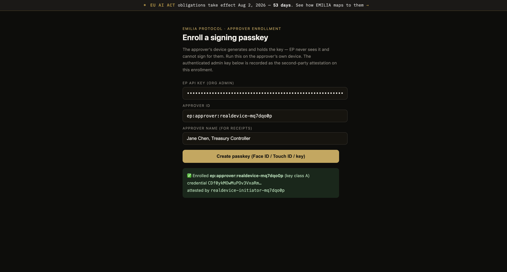

# Build ticket: Class A signoff — WebAuthn approver-held keys

**Why this build.** Today EP signs receipts server-side — Class C in the
draft's own taxonomy (`standards/draft-schrock-ep-authorization-receipts-00.md`
§5.1), the tier the spec says new deployments shouldn't use. This ticket makes
G2 true in production: the named human signs the action hash on their own
device (Face ID / YubiKey), the server orchestrates but **cannot forge a
signoff**. Closes THREAT_MODEL.md #1 and #2 simultaneously; prerequisite for
the pilot.

**Library.** `@simplewebauthn/server` + `@simplewebauthn/browser` (v13+).
Battle-tested; do not hand-roll WebAuthn verification.
**rpID:** `emiliaprotocol.ai` · **origin:** `https://www.emiliaprotocol.ai`.

---

## 0. Honesty pre-step (ship first, ~30 min)

Add `key_class: "C"` to every receipt the current mint path produces
(`lib/create-receipt.js` + receipt schema + verify package tolerance). Until
Class A ships, receipts should say what they are. This is the draft's §5.1
labeling MUST applied to ourselves.

## 1. Enrollment

**Table `approver_credentials`:**

```sql
create table approver_credentials (
  id uuid primary key default gen_random_uuid(),
  approver_id text not null,            -- ep:approver:...
  credential_id text not null unique,   -- b64u
  public_key_cose text not null,        -- b64u COSE key
  key_class text not null default 'A',
  sign_count bigint not null default 0,
  transports text[],
  attestation_fmt text,
  attested_by text,                     -- second-party attestation (org admin
                                        -- approver_id) — draft §5.2 MUST when
                                        -- EP operates the directory
  valid_from timestamptz not null default now(),
  valid_to timestamptz,
  revoked_at timestamptz
);
```

**Endpoints:**
- `POST /api/v1/approvers/webauthn/register-options` →
  `generateRegistrationOptions({ rpName: 'EMILIA Protocol', rpID,
  userName: <email>, attestationType: 'direct',
  authenticatorSelection: { userVerification: 'required',
  residentKey: 'preferred' } })`. Persist the challenge (single-use, 5-min
  TTL).
- `POST /api/v1/approvers/webauthn/register-verify` →
  `verifyRegistrationResponse({ expectedChallenge, expectedOrigin,
  expectedRPID, requireUserVerification: true })`; insert credential row.
  Record `attested_by` (the org admin who confirmed this enrollment) — pilot
  uses a recorded attestation, the full Merkle directory comes later.

## 2. Signing — the core binding

The draft's one non-negotiable: **WebAuthn challenge = context hash.**

```
challenge = SHA-256( JCS(AuthorizationContext) )   // raw 32 bytes, b64u in options
```

The Authorization Context already contains `action_hash`, `policy_hash`,
`nonce`, `expires_at`, `approver` — so the challenge is action-bound and
**single-use by construction** (the nonce lives inside what's hashed). A
replayed assertion fails twice: wrong challenge at the WebAuthn layer, spent
nonce at the consumption layer.

Reuse the JCS canonicalizer from `packages/verify` (byte-identical
serialization is the point; amounts stay strings per draft §3).

**Endpoints:**
- `POST /api/v1/signoffs/[id]/webauthn-options` — build + persist the
  canonical Authorization Context; return
  `generateAuthenticationOptions({ challenge: b64u(contextHash),
  allowCredentials: <approver's credential_ids>,
  userVerification: 'required' })`.
- `POST /api/v1/signoffs/[id]/approve-webauthn` — recompute the context hash
  server-side from stored canonical bytes;
  `verifyAuthenticationResponse({ expectedChallenge: b64u(contextHash),
  expectedOrigin, expectedRPID, requireUserVerification: true })`; reject
  sign-count regression; existing SoD check (approver ≠ initiator) unchanged;
  mark approved; store the assertion
  `{ authenticator_data, client_data_json, signature, key_class: 'A',
  approver_key_id }` into the receipt's signoff (draft §5.3 shape).

**Render page `/signoff/[id]`** — draft §11.3 control (1): server-render
amount / beneficiary / action_type **from the same stored canonical Action
Object bytes that were hashed**, never from a re-described copy. Show the
context-hash prefix (first 8 hex) for cross-checking. Button calls
`startAuthentication()` from `@simplewebauthn/browser`.

## 3. Offline verification — `@emilia-protocol/verify` v2

Extend the verifier to validate Class A signoffs with zero network:
- ES256 (WebCrypto P-256, `node:crypto` webcrypto) over
  `authenticatorData || SHA-256(clientDataJSON)`.
- Parse `authenticatorData` flags: require UP and UV bits.
- `clientDataJSON.type === 'webauthn.get'`;
  `clientDataJSON.challenge === b64u(recomputed context hash)`.
- Key from the receipt's `approver_key_proofs` (pilot: pinned key entry).

~150 LOC, zero-dep. This is the demo: *CFO approves with Face ID; the receipt
verifies offline with no EP server.*

## 4. Pilot telemetry — the actual deliverable

The gate is the excuse; the data answers the two questions no document can
(is there a buyer; does a tired human read before signing).

```sql
create table signoff_metrics (
  signoff_id text primary key,
  rendered_at timestamptz,
  signed_at timestamptz,
  time_to_sign_ms int,        -- THE number; near-floor = rubber-stamp
  decision text,              -- approved | denied | expired
  planted_mismatch boolean default false,  -- consented drill (draft §11.8)
  mismatch_caught boolean
);
```

- Instrument render-page load → signature delta.
- At least one consented planted-mismatch drill during the pilot (rendered
  beneficiary ≠ hashed one, injected at the render layer with the partner's
  written consent). If they sign it, our strongest claim is empirically false
  and we want to be the ones who find out.
- Week-4 retention query: do they still use it after novelty dies.

## 5. Explicit non-goals (pilot)

No m-of-n, no directory Merkle tree (pin keys), no delegation, no federation,
no dashboard, no second action type. One action type, one policy, one real
approver who isn't us.

## Acceptance

1. Enroll a passkey on a real device (Mac Touch ID + one cross-platform
   YubiKey test).
2. End-to-end: agent proposes → policy gates → approver opens `/signoff/[id]`
   → Face ID → receipt mints with `key_class: 'A'` + WebAuthn assertion.
3. `verify` v2 validates the receipt offline; tampering the amount breaks it;
   replaying the assertion is rejected (both layers).
4. Sign-count regression and wrong-origin assertions rejected (negative
   tests).
5. `time_to_sign_ms` lands in `signoff_metrics`.

**Estimate:** 2–3 dev-days. **Follow-up (tracked, not this ticket):** extend
the Alloy model with directory enrollment/attestation + m-of-n (draft §11.5
names this gap); witness cosigning for checkpoints.

## Accepted on real hardware (2026-06-09)

All five acceptance steps passed with a real Touch ID passkey. Evidence —
note the approved page's context hash `b68e427d…` is byte-identical to what
the offline verifier reproduces from the receipt:




```
$ node scripts/e2e-offline-verify.mjs sig_0d9eb593522b7426cc49eceaed8c3ab3
checks: challenge_binding ✓ client_data_type ✓ user_present ✓
        user_verified ✓ rp_id_hash ✓ signature ✓        VALID ✅
forgery (action_hash swapped): rejected ❌
telemetry: time_to_sign_ms 20532 · decision approved · key_class A
```
