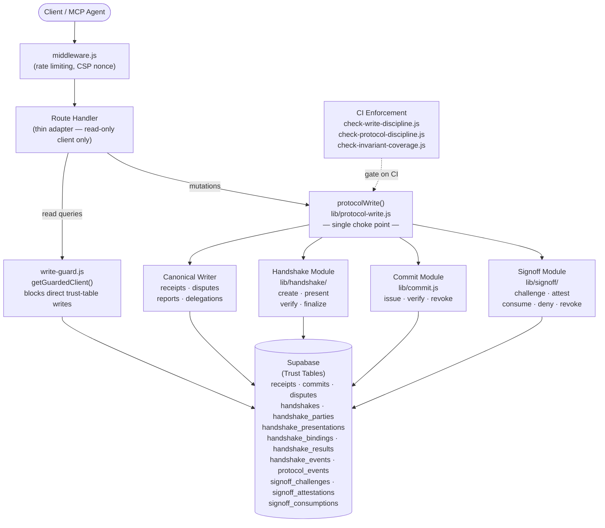

# EMILIA Protocol -- Architecture Overview

## What EP Is

EMILIA Protocol (EP) is a trust substrate for high-risk action enforcement. It provides a structured, auditable pipeline through which every trust-changing operation must pass. EP does not implement business logic directly; it enforces that trust decisions are made through a verified, logged, policy-bound process with cryptographic binding and replay resistance.

EP exists because trust-changing writes (issuing a commit, filing a dispute, confirming a receipt, verifying a handshake) carry consequences that cannot be undone by a retry. Every such write must be attributable to an authenticated actor, bound to a specific policy version, logged durably before state change, and protected against replay.

## Core Objects

| Object | Table(s) | Purpose |
|---|---|---|
| **Receipt** | `receipts` | Record of a trust-bearing interaction between entities. May be unilateral or bilateral (confirmed by counterparty). |
| **Commit** | `commits` | An issued, verifiable, revocable trust commitment from one entity. |
| **Dispute** | `disputes` | A formal challenge to a receipt, with structured lifecycle (filed -> responded -> resolved -> appealed -> appeal_resolved / withdrawn). |
| **Trust Report** | `trust_reports` | A filed report against an entity (abuse, fraud, etc.). |
| **Handshake** | `handshakes`, `handshake_parties`, `handshake_presentations`, `handshake_bindings`, `handshake_results` | Pre-action trust enforcement. Binds identity, authority, and policy to a specific action before it executes. |
| **Protocol Event** | `protocol_events` | Append-only log of every trust-changing state transition across all aggregate types. |
| **Handshake Event** | `handshake_events` | Append-only log of every state change within a handshake lifecycle. |

## Why Handshake Exists

Handshakes enforce trust requirements **before** an action executes, not after. A handshake binds:

- **Identity**: Which authenticated entities are involved (parties with roles: initiator, responder, verifier, delegate).
- **Authority**: Whether each party's issuer is trusted (looked up from an authority registry, never embedded keys).
- **Policy**: What claims, assurance levels, and binding requirements must be satisfied.
- **Action context**: What specific action (action_type, resource_ref) this handshake authorizes.

Without a verified handshake, the downstream action has no trust basis. The handshake is consumed exactly once upon use, preventing replay.

## How Trust Decisions Are Produced

Every trust-changing write flows through `protocolWrite()` (defined in `lib/protocol-write.js`). The pipeline:

```
1. assertInvariants(command)      -- structural protocol invariants
2. VALIDATORS[command.type]()     -- type-specific schema validation
3. resolveAuthority(command)      -- normalize actor identity
4. checkAbuse() (if applicable)   -- rate-limit / abuse detection
5. computeIdempotencyKey()        -- content-addressed dedup
6. HANDLERS[command.type]()       -- delegate to canonical function
7. buildProtocolEvent()           -- construct append-only event
8. appendProtocolEvent()          -- persist event (MUST succeed)
9. setIdempotencyCache()          -- cache for dedup
10. emitTelemetry()               -- structured observability log
11. return result                 -- projection to caller
```

If step 8 (event persistence) fails, the entire operation is rejected. An unlogged trust-changing transition is never acceptable.

## How Policy Binds

Policy is resolved by `resolvePolicy()` in `lib/handshake/policy.js`. Resolution order:

1. If `policy_id` is provided, load by primary key.
2. If `policy_key` + `policy_version` are provided, load by key and version.
3. If only `policy_key`, load the latest active version.

At handshake initiation, the policy's rules are hashed: `SHA-256(JSON.stringify(policy.rules, sorted_keys))`. This `policy_hash` is stored on the handshake record. At verification time, the policy is re-loaded and re-hashed. If the hash differs, verification fails with `policy_hash_mismatch`. This prevents policy drift between initiation and verification.

If policy cannot be loaded at verification time, the handshake is rejected (`policy_load_failed` or `policy_not_found`). Policy resolution is fail-closed.

## How Replay Is Prevented

Five mechanisms work together:

1. **Nonce**: 32-byte random hex (`crypto.randomBytes(32).toString('hex')`), unique per binding.
2. **Expiry**: Binding TTL clamped to [60s, 1800s]. Expired bindings are rejected.
3. **Binding hash**: `SHA-256` of all canonical binding fields (action, policy, parties, payload, nonce, expiry). Content-addresses the exact action context.
4. **One-time consumption**: Upon accepted verification, the binding's `consumed_at` is set. The `consumed_at IS NULL` filter on update ensures only unconsumed bindings can be consumed. A hard gate at the top of `_handleVerifyHandshake` rejects already-consumed bindings before any processing.
5. **Idempotency key**: `SHA-256(command.type + actor + JSON.stringify(input))` provides content-addressed dedup with a 10-minute TTL cache.

## Where Events Fit

EP has two event systems:

1. **`protocol_events`**: Written by `appendProtocolEvent()` inside `protocolWrite()`. Covers all 17 command types across all aggregate types (receipt, commit, dispute, report, handshake). Each event records: `event_id`, `aggregate_type`, `aggregate_id`, `command_type`, `parent_event_hash`, `payload_hash`, `actor_authority_id`, `idempotency_key`, `created_at`.

2. **`handshake_events`**: Written by `requireHandshakeEvent()` (mandatory) or `emitHandshakeEvent()` (best-effort). Covers handshake-specific lifecycle events: `initiated`, `presentation_added`, `status_changed`, `verified`, `rejected`, `expired`, `revoked`. Each event records: `event_id`, `handshake_id`, `event_type`, `actor_entity_ref`, `detail`, `created_at`.

Events are written **before** the corresponding state change. If the event write fails, the state change does not proceed. If the event write succeeds but the state change fails, the event log records an attempted transition that can be retried.

Both tables are append-only. Database triggers prevent UPDATE and DELETE operations.

## System Diagram



**Write discipline summary:**
- Route handlers receive a guarded Supabase client (`getGuardedClient()`) that blocks mutations on trust tables at the proxy level.
- All trust-changing mutations route through `protocolWrite()`, which enforces invariant checks, idempotency, event-first logging, and telemetry.
- CI scripts verify at build time that no route imports a service client directly.
