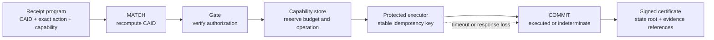

<!-- SPDX-License-Identifier: Apache-2.0 -->
# Receipt-Program Execution Kernel

**Status:** JavaScript reference implementation

**Package:** `@emilia-protocol/gate/receipt-program`

**Primary rule:** the receipt describes an exact bounded instruction; Gate still owns authorization and consequence control

## Why this exists

EMILIA already had the necessary trust primitives: CAID for material-action
identity, authorization receipts and AEC for evidence, bounded capabilities for
delegated budget, Gate for reserve-before-effect enforcement, and durable
execution evidence for uncertain outcomes. The receipt-program kernel composes
those primitives into one bounded developer surface. The instruction descriptor
and certificate encoding are deterministic; external execution is not.

It does not introduce another policy engine, ledger, token, blockchain, or
authorization format. A receipt program is a frozen instruction that Gate can
execute once under the relying party's existing trust configuration. When Gate
has produced terminal evidence, the configured signer succeeds, and the
complete certificate is appended to the evidence log, the output is an
operator-signed certificate that another party can verify offline. Signing or
persistence failure is returned as a typed failure without rewriting Gate's
terminal consequence state.



## Instruction model

The v1 reference kernel intentionally has a small instruction vocabulary. Each
opcode names a transition that is already enforced by a concrete component.

| Opcode | Enforced meaning |
| --- | --- |
| `RECEIPT` | Freeze the program identifier, instruction identifier, CAID, exact observed action, selector, capability projection, capability-receipt digest, and stable operation identifier. |
| `MATCH` | Recompute CAID with the constructor-pinned resolver and require the same stable operation identifier in the executor-owned action. |
| `RESERVE` | Let Gate verify the ordinary authorization and atomically reserve the signed bounded capability before provider entry. |
| `EXECUTE` | Invoke the configured effect once with frozen authorization/operation snapshots, an abort signal, and Gate's action-bound provider idempotency key. |
| `COMMIT` | Commit the operation and bounded spend as executed and append execution evidence. |
| `COMMIT_INDETERMINATE` | Keep the spend and operation closed when provider entry occurred but the outcome cannot be proved. |
| `HALT` | Stop this receipt program and prohibit blind replay of the same operation. This is not a claim that the whole runtime entered global safe mode. |
| `CERTIFY` | Sign the content-addressed program, outcome, bounded result projection, step sequence, context, and Gate evidence references under a separately pinned operator key. |

Delegation is performed before execution with the existing
`delegateCapabilityReceipt()` primitive. It atomically deducts the child budget
from the parent; the receipt-program kernel cannot create or widen budget. A
failure while registering a newly delegated child still requires reconciliation
of that pre-execution delegation operation.

## Production construction

Production mode refuses to construct unless all of these conditions hold:

- Gate has a strict, fork-aware, atomic, durable evidence log;
- Gate has a durable bounded-capability store;
- certificate signing is supplied by an external KMS/HSM adapter;
- issuer, tenant, environment, audience, and signer key ID are pinned in the
  certificate context; and
- a constructor-pinned result projector defines the disclosed provider fields.

CAID resolution, Gate trust, the operation-id field, effect deadline, clock,
certificate signer, certificate context, and disclosure projector are
constructor-pinned. A run request cannot replace them. Provider code receives
deep-frozen copies of the authorization and operation, plus an abort signal.
Programs are limited to 512 KiB, projected results to 128 KiB, certificate
cores to 768 KiB, and identifiers to 256 UTF-8 bytes. Accessors, aliases,
cycles, sparse arrays, excessive nesting, unsafe integers, and non-canonical
Unicode are refused before provider entry.

The demo explicitly enables process-local state. That opt-in is for tests and
examples only:

```bash
npm run demo:receipt-program
```

The reference implementation persists complete certificates in Gate's existing
atomic evidence log, so it does not add a schema migration. A deployment that
requires the capability commit and certificate publication to survive every
possible process crash as one transactional unit needs a deployment-specific
transactional outbox or equivalent recovery design; this module does not claim
cross-store atomicity.

## Certificate verification

`verifyReceiptProgramCertificate()` verifies:

1. the exact certificate, context, program, evidence-reference, and step
   schemas;
2. the Ed25519 signature under the exact public key mapped to the signed key ID
   and expected issuer/tenant/environment/audience/key context;
3. canonical timestamps, the certificate state root, and program/result
   digests;
4. the exact opcode sequence for the declared terminal outcome;
5. executed/indeterminate/refused result and evidence consistency;
6. authorization-to-execution ordering and hash linkage;
7. exact action-digest and operation-id binding;
8. CAID by calling the verifier's independently pinned resolver again; and
9. optionally, the full certificate record plus a relying-party-owned inclusion
   check against the pinned evidence stream.

`verification.ok` means that the certificate is valid under those inputs. It
does not mean the provider succeeded: callers must also inspect
`verification.outcome`, `execution_succeeded`, `evidence_complete`, and
`certificate_persisted`.

A self-hashed record is not proof of persistence. The verifier sets
`certificate_persisted` only when the record hash/shape is valid and the
caller-pinned `verifyCertificateInclusion` function confirms that exact record
in its trusted stream. The callback is synchronous by design; deployments may
prepare a trusted stream snapshot or inclusion proof before offline verification.

The certificate carries compact authorization and execution references and is
itself retained as a complete evidence-log record. A verifier that needs full
re-performance must obtain and verify the referenced authorization,
capability, and evidence-log records under its own trust configuration.
`recoverCertificates(programDigest)` is an explicit recovery scan; it returns
all independently verified matching records and does not guess which attempt a
caller meant.

## Failure behavior

| Failure point | Effect entered? | Terminal result | Replay authority |
| --- | ---: | --- | --- |
| Malformed program, CAID mismatch, runtime trust injection, or operation relabeling | No | `refused` | No spend was reserved; a corrected, separately evaluated request may be submitted. |
| Gate authorization, scope, budget, replay, or durable-state refusal | No | `refused` | Determined by the underlying authorization and capability state; no effect is called. |
| Provider throws, times out, returns non-canonical data, or loses its response | Yes | `indeterminate` | The original operation remains consumed or ownership-fenced and cannot be blindly retried. |
| Provider returns an accepted bounded projection and Gate commits evidence | Yes | `executed` | The original operation is permanently closed. |
| Gate commits execution but its execution-evidence append cannot be recovered | Yes | `executed` plus `execution_evidence_unavailable`; no certificate | Never relabel the committed effect as indeterminate or issue contradictory proof. |
| Certificate signer fails | Determined by Gate | Gate outcome preserved plus `certificate_signing_failed`; no certificate | Determined by Gate's durable terminal state. |
| Complete-certificate evidence append fails | Determined by Gate | Gate outcome preserved plus `certificate_persistence_failed`; signed certificate returned but not claimed persisted | Use the explicit recovery/outbox policy; never treat the unlogged certificate as durable proof. |

## Claim boundary

When signature, context, content, and evidence checks pass, the certificate
proves integrity and internal binding under a pinned operator key. It is not a
Bulletproof, zk-SNARK, consensus result, provider attestation, proof of physical
outcome, or proof that an action was wise, legal, safe, or commercially
appropriate. It does not make the certificate signer independent.

The existing optional range-receipt module is the repository's distinct
zero-knowledge surface. Receipt programs neither require nor imply it. Existing
anchoring transports may later anchor a certificate state root, but blockchain
settlement is not part of this kernel and is not required for verification.
