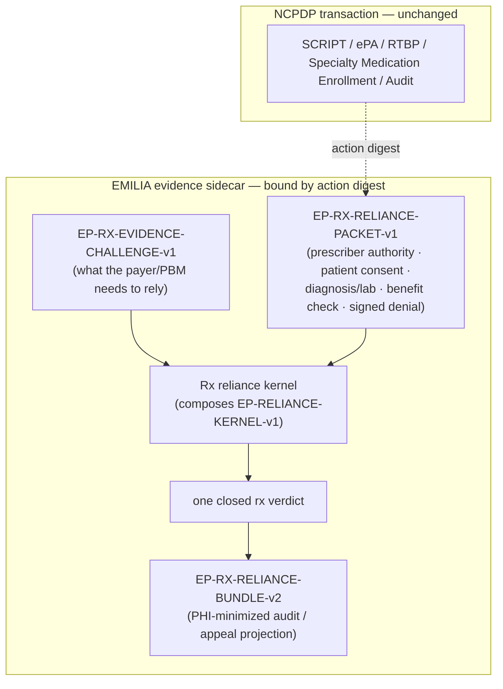

<!-- SPDX-License-Identifier: Apache-2.0 -->
# NCPDP Rx Reliance Companion (EP-NCPDP-RX-RELIANCE-PROFILE-v1)

**We are not replacing NCPDP SCRIPT, Telecom, RTBP, ePA, Specialty Medication
Enrollment, or the Audit Transaction Standard. We are adding a portable evidence
sidecar that lets every party compute the same reliance verdict before
approving, denying, dispensing, transferring, or auditing a drug transaction.**

This is a candidate companion profile, not a new protocol and not an NCPDP
standard until NCPDP adopts it. It rides beside an existing transaction, bound to
it by an action digest, and stays out of the transaction's own fields.

## The gap this fills

CMS is moving medical prior authorization onto FHIR APIs under the 2024
Interoperability and Prior Authorization Final Rule (CMS-0057-F), but that rule
repeatedly excludes drugs from the PA API requirements. NCPDP already owns the
pharmacy rails. What is missing is a standard way to prove the evidence behind
an automated drug-authorization decision: that the prescriber had authority,
that the patient consented, that the diagnosis and lab evidence exist, that the
formulary policy was the pinned one, that the benefit check was fresh, and that a
denial carries a signed, appealable reason.

We built a working candidate for that gap.

## The sidecar, in one picture

The NCPDP transaction is untouched. The EMILIA sidecar carries the admissibility.

## The flow

1. A prescriber agent submits the drug request (riding beside an NCPDP ePA / SCRIPT transaction).
2. The payer/PBM returns an **EP-RX-EVIDENCE-CHALLENGE-v1**: prescriber authority, patient consent, diagnosis/lab evidence, the formulary/benefit policy, revocation freshness, and a signed reason if the determination is a denial.
3. The prescriber / pharmacy / hub resubmits an **EP-RX-RELIANCE-PACKET-v1**.
4. The kernel returns exactly one closed verdict. A privacy-safe appeal/audit
   projection carries keyed references to the evidence retained in the holder's
   controlled vault; it does not recursively copy the transaction.

## The closed verdict set

`rx_rely` is the only success. It covers **both** a dispensable approval and a
signed, reasoned, appeal-ready denial: reliance is not approval, and a properly
signed denial is equally relyable (you rely on it by not dispensing and by
holding an appeal-ready record). `result.determination` says which.

| Verdict | Cause |
|---|---|
| `rx_rely` | Every required leg composes (approve), or the denial is signed and bound (deny). |
| `rx_do_not_rely_missing_prescriber_authority` | The prescriber's scoped authority for this exact action could not be relied on (absent, revoked, expired, out of scope, wrong signer, stale revocation, unpinned registry). |
| `rx_do_not_rely_missing_patient_consent` | No accepted `EP-RX-CONSENT-v1` bound to this action. |
| `rx_do_not_rely_missing_clinical_evidence` | No accepted `EP-RX-CLINICAL-v1` (diagnosis/lab) bound to this action. |
| `rx_do_not_rely_policy_mismatch` | The request or the RTBP benefit check cites a formulary policy other than the pinned one. |
| `rx_do_not_rely_stale_benefit` | The RTBP benefit/formulary check is missing or older than the pinned freshness bound. |
| `rx_do_not_rely_signed_denial_required` | A denial was presented without a signed, bound reason, so it cannot be relied on or appealed. |

## How it composes (honestly)

The prescriber-authority, formulary-policy, and revocation-freshness legs are the
shipped **EP-RELIANCE-KERNEL-v1** underneath (`packages/verify/reliance.js`); this
profile does not reimplement that crypto. The Rx-specific legs (patient consent,
diagnosis/lab evidence, signed denial) are Ed25519-signed artifacts, each bound to
the action digest and verified under a relying-party-pinned key.

- **VERIFIED vs ACCEPTED stays separate.** A signature checking out is not the
  same as the issuer key being one the relying party pinned.
- **Minimized portable data.** `EP-NCPDP-RX-PRIVACY-PROFILE-v1` requires
  pairwise patient references, exact signed-artifact field sets, coded values,
  and domain-separated keyed commitments to underlying records. Bare hashes of
  low-entropy clinical facts are not accepted.
- **Key rotation remains reproducible.** Every artifact and appeal projection
  names its non-secret privacy-key identifier; the key itself remains in the
  deployment's controlled key store.
- **Fail-closed.** A required leg that is absent, unverifiable, mis-bound, stale,
  or from an unpinned issuer yields the matching `rx_do_not_rely_*` verdict.

## Why the terrain fits

NCPDP already thinks in these terms. SCRIPT carries electronic prior
authorization and other prescribing transactions; RTBP communicates eligibility,
coverage, benefit financials, restrictions, and alternatives; Specialty
Medication Enrollment moves patient, coverage, prescription, and clinical data
among pharmacies, hubs, manufacturers, and others; and the Audit Transaction
Standard already models requests, responses, and final outcomes. This profile
adds the one thing those transactions do not carry today: a portable,
cryptographically verifiable proof of the evidence behind the decision.

## What is in the repo

- `profiles/ncpdp/rx-reliance-profile.v1.json` — the profile descriptor.
- `profiles/ncpdp/privacy-profile.v1.json` — the data-minimization and key-rotation contract.
- `profiles/ncpdp/specialty-pa-evidence-challenge.v1.json` — an illustrative payer challenge.
- `lib/ncpdp/rx-reliance.js` — the reference evaluator (`evaluateRxReliance`, `verifyRxArtifact`, `buildRxAppealBundle`).
- `examples/ncpdp/specialty-pa-reliance-flow.mjs` — a full offline flow (`node examples/ncpdp/specialty-pa-reliance-flow.mjs`).
- `conformance/vectors/ncpdp-rx-reliance.v1.json` + `tests/ncpdp-rx-reliance.test.js` — a positive approve, a positive signed deny, and a reject for every `rx_do_not_rely_*` verdict.
- `tests/ncpdp-privacy.test.js` — pairwise-linkability, bare-hash, direct-field,
  free-text, future-timestamp, signed-envelope-smuggling, and planted-PHI export attacks.

## Sources

- NCPDP standards (SCRIPT / ePA, RTBP, Telecom, Specialty Medication Enrollment, Audit Transaction Standard): https://standards.ncpdp.org/Access-to-Standards.aspx
- CMS Interoperability and Prior Authorization Final Rule (CMS-0057-F), including the drug exclusions from the PA API requirements: https://www.cms.gov/newsroom/fact-sheets/cms-interoperability-prior-authorization-final-rule-cms-0057-f

## Status

Candidate companion profile / operating-rule candidate. No EP Internet-Draft is
IETF-adopted or endorsed, and this profile is not an NCPDP standard or operating
rule until NCPDP adopts it. Offered for review.
