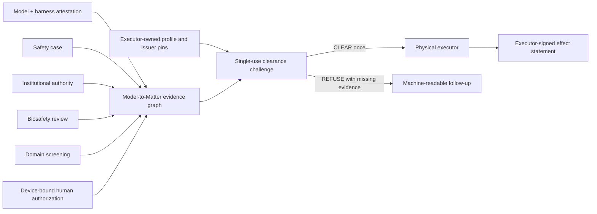

# Model-to-Matter: Verifiable clearance for AI-designed experiments

Status: reference profile and adversarial demonstration, July 2026

## The missing boundary

Frontier models can now propose experimental workflows and operate automated
laboratory systems. Existing controls answer important but separate questions:

- Was this model artifact signed?
- Did a safety evaluation run?
- Is this researcher or institution authorized?
- Did a biosafety reviewer approve the protocol?
- Did a domain-specific screening service pass the material request?
- Did a responsible human approve execution?

The physical executor still needs one answer before it acts:

> Do all required authorities agree about this exact model, harness, protocol,
> material commitment, destination, facility, purpose, and one permitted
> clearance attempt?

Model-to-Matter is the narrow clearance boundary that composes those facts. It
does not replace any issuer. The executor supplies the acceptance policy and
pins every trusted issuer key.



## Portable objects

### Exact action

`EP-MODEL-TO-MATTER-ACTION-v1` binds:

- model provider, model identifier, manifest digest, harness digest, and
  safeguards digest;
- protocol digest, opaque materials commitment, and expected-effects digest;
- institution and principal;
- executor and facility;
- purpose and jurisdiction;
- destination digest, request time, and `max_executions: 1`.

Unknown fields fail closed. Raw sequences, FASTA, protocol text, prompts,
completions, and reasoning traces are forbidden. The server computes the action
digest; the presenter cannot choose it.

The registered action type is `science.bio.experiment.execute.1`. The executor
also computes its `jcs-sha256` Canonical Action Identifier (CAID) over the exact
same closed object and refuses if CAID and `action_digest` do not encode the
same SHA-256 result. The durable one-clearance key, clearance record, and signed
effect statement carry that CAID. CAID is the portable name of the action; it
does not authorize the action or assert that the experiment is safe.

### Relying-party profile

`EP-MODEL-TO-MATTER-PROFILE-v1` fixes an AND requirement over six evidence
types. It cannot disable action agreement or revocation requirements. The
executor pins accepted `(issuer_id, Ed25519 public key)` pairs, freshness windows,
the allowed action type, and the minimum human-assurance class.

### Evidence adapters

`EP-MODEL-TO-MATTER-EVIDENCE-v1` is a closed normalized adapter output, not a
new biological credential. Each artifact is domain-separated, Ed25519-signed,
bound to the exact action digest, time-bounded, and checked against caller pins.
Cryptographic verification and relying-party acceptance are separate results.

The adapter schemas intentionally preserve issuer ownership:

| Evidence type | Minimum signed binding |
| --- | --- |
| `model_attestation` | provider, model, manifest, harness, safeguards |
| `safety_case_attestation` | model commitments, safety-case digest, assessment |
| `institutional_authority` | organization, principal, action family, purpose, decision |
| `biosafety_review` | protocol, material commitment, facility, decision |
| `domain_screening` | material commitment, destination, screening-profile digest, decision |
| `human_authorization` | approver, decision, assurance class |

### Clearance and effect

The executor mints and durably registers a short-lived evidence challenge. The
challenge binds the server-computed action and the executor's complete profile.
Its nonce is atomically consumed on the first evaluation attempt. A partial
presentation returns a follow-up challenge naming only the missing evidence.
After an admissible evaluation, a separate atomic store consumes the action
digest itself, so two different challenges cannot each clear the same
`max_executions: 1` action.

Production integrations use `createModelToMatterExecutor()`. It snapshots the
relying-party profile, captures the validated challenge/action-store methods,
and pins a revocation provider at construction. Transaction input may carry
only the action, registered challenge, and evidence graph; a profile, store,
clock, revocation set, or verifier supplied with that presentation is refused.
Its `run()` method obtains one clearance before invoking the effect adapter and
passes only a frozen pre-await action snapshot to that adapter.

A successful evaluation returns `clear_to_execute`. Every other result is a
closed `do_not_execute_*` verdict. After execution, the pinned executor may sign
an `EP-MODEL-TO-MATTER-EFFECT-v1` statement binding the action digest, CAID,
clearance replay digest, time, status, and observed-effect digest.

## Properties exercised in code

The public test contract, deterministic vector suite, and demo cover:

- raw-content and unknown-field rejection;
- registered CAID computation and action-substitution refusal;
- action mutation and cross-action replay;
- unpinned-key and issuer-identity substitution;
- profile weakening and assurance-enum confusion;
- claim-to-action mismatch;
- expired and revoked evidence;
- absent revocation state;
- missing evidence and machine-readable follow-up;
- one winner under concurrent presentation;
- one winner across independently issued challenges for the same action;
- refusal of replayed challenges;
- mutation after signing;
- executor substitution and effect tampering;
- hostile graph shapes that never clear.

Run:

```bash
node examples/model-to-matter/demo.mjs
npm run m2m:conformance
npx vitest run tests/model-to-matter.test.js tests/model-to-matter-security-branches.test.js tests/model-to-matter-mutation-oracles.test.js
npm run test:mutation:model-to-matter
```

The published Experimental Internet-Draft source is archived locally at
`standards/posted/draft-schrock-model-to-matter-00.xml`. It specifies the
executor-side lifecycle and explicit non-goals. Publication establishes the
open Model-to-Matter name; it does not establish deployment, adoption,
partnership, or endorsement.

## Integration shape

An initial pilot needs adapters, not replacement systems:

1. A model deployment emits its existing manifest and safeguards attestations.
2. A safety evaluator signs the digest of its existing safety case.
3. The institution maps its authorization decision into the authority adapter.
4. A biosafety process signs its protocol and facility decision.
5. A screening provider signs a result bound to the opaque materials commitment
   and destination.
6. A responsible person completes a device-bound approval ceremony.
7. A cloud-lab or instrument gateway evaluates the graph and consumes the
   challenge immediately before execution.

GPT-Rosalind can be evaluated in a non-authoritative role: extracting candidate
risk metadata from a protocol, identifying missing context, and proposing an
evidence request. The model must never mint authority, waive evidence, choose
trusted keys, or turn a refusal into clearance.

## Explicit limitations

- No sequence screening is implemented. A `domain_screening` artifact reports
  what a pinned external screening adapter signed.
- Revocation state is an explicit trusted runtime input. Absence fails closed,
  but this version does not yet define a portable authenticated non-revocation
  snapshot or prove that a host supplied the latest view.
- Opaque commitments protect disclosure only if their source system computes
  them over the intended material with an agreed canonicalization.
- An accepted signature proves what a pinned issuer stated, not that the issuer
  made a scientifically correct judgment.
- An effect statement proves what the pinned executor signed. It does not
  independently prove sensor integrity or physical truth.
- The action-level clearance store must be shared, durable, and retained without
  automatic TTL reopening. A lost clearance response remains consumed and needs
  operator reconciliation; availability never silently becomes a second grant.
- The low-level evaluator accepts executor dependencies as explicit arguments
  for testing and advanced composition. Applications should expose the pinned
  executor factory, not map an untrusted request body directly into that
  low-level function.
- This profile has not been deployed in a wet lab and claims no commercial or
  research partnership.

These boundaries are deliberate. The contribution is a reproducible,
fail-closed join between existing safety authorities at the moment a digital
proposal can become a physical action.
