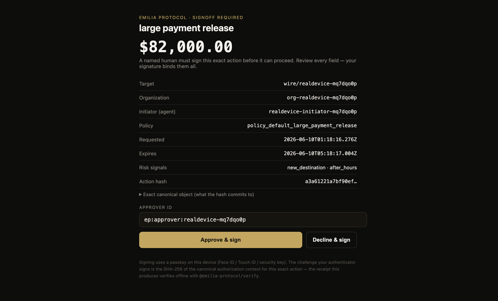
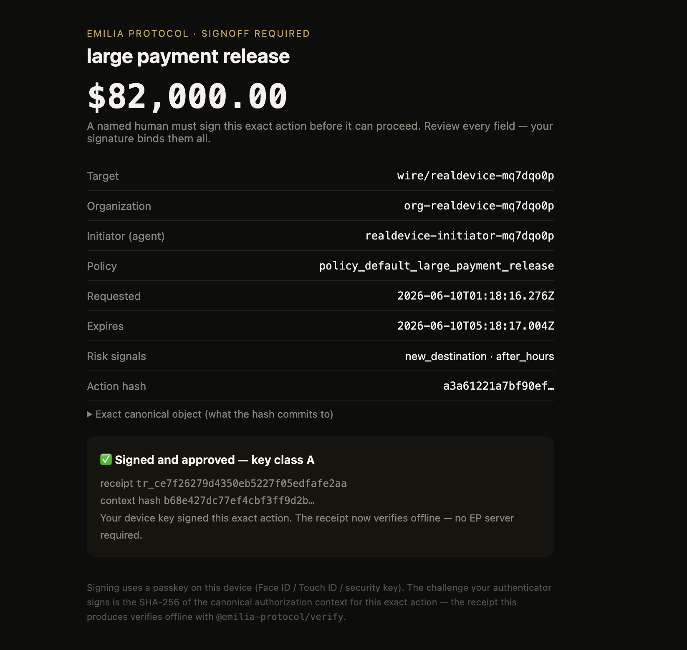

# EMILIA Guard — a Claude Code plugin

**A named human's signed "yes" before Claude does anything irreversible.**

Anthropic's own data on ~1M production tool calls found that **0.8% of agent
actions are irreversible** — moving money, deleting data, modifying production,
communicating externally — and that those are exactly the actions that should
"require mandatory human approval before execution"
([Measuring agent autonomy](https://www.anthropic.com/news/measuring-agent-autonomy)).

Claude Code already lets you *prompt* for those. EMILIA Guard makes the approval
**accountable**: a named human approves on their own device (Face ID / passkey),
and the action proceeds only with an **offline-verifiable Trust Receipt** that
neither a compromised agent nor EMILIA itself can forge.

## Install

```
/plugin marketplace add emiliaprotocol/emilia-protocol
/plugin install emilia-guard@emilia-protocol
```

That's it. With no further config you're in **local mode**: any high-risk tool
call (destructive shell, writes to `.env`/secrets/CI, money/external MCP tools)
is held for an explicit human prompt. Zero account required.

## Upgrade to signed receipts (EMILIA mode)

Set two env vars and high-risk financial/external actions get minted against
EMILIA's formally-verified policy engine, then routed to a real approver's
device:

```bash
export EP_API_KEY="ep_live_…"     # from emiliaprotocol.ai
export EP_ORG_ID="your-org-id"
```

Money/external MCP calls go to the policy engine; purely local risk
(destructive shell, secret files) stays a local human prompt — it never
pollutes the financial audit trail. When Claude (via an MCP tool, e.g. a
payments or email server) tries to move money or send something, the hook:

1. **mints** a pre-action Trust Receipt (server-side policy engine decides),
2. **opens a signoff** for a named human,
3. **blocks** while they approve on their device (up to `EP_SIGNOFF_TIMEOUT_S`,
   default 280s),
4. returns `allow` **only** on a real signature — with a receipt you can verify
   offline: `npx @emilia-protocol/verify`.

## Proven against production

This exact flow ran end-to-end against the live API (2026-06-10): a simulated
`mcp__payments__create_wire_transfer` for **$82,000** was intercepted, a Trust
Receipt was minted by the formally-verified policy engine, a real signoff
opened, the hook polled, no human approved, and it returned:

```json
{ "permissionDecision": "ask",
  "permissionDecisionReason": "EMILIA — signoff timed out after 35s. Approve at https://www.emiliaprotocol.ai/signoff/sig_…, or confirm manually. Failing closed." }
```

The same protocol's device signoff is accepted on real hardware — a Touch ID
approval of an $82,000 wire whose receipt verifies offline (all six checks,
forgery rejected, `key_class: A`, `time_to_sign_ms: 20532`):

| The hold | The signed approval |
|---|---|
|  |  |

The approved screenshot's context hash (`b68e427d…`) is the same hash the
offline verifier reproduces from the receipt — screenshot, receipt, and math
agree on one event.

## Fail-closed, always

On any error, timeout, denial, or ambiguity the decision is `ask` or `deny` —
**never** `allow`. A trust gate that fails open is not a gate. If EMILIA is
unreachable, you get a normal human prompt, not a silent pass.

## Tuning what counts as high-risk

The built-in classifier is conservative. Add your own triggers (plain
case-insensitive substrings, one per line — no regex needed):

```bash
export EP_GUARD_PATTERNS=$'wire\nproduction\nacme-corp\ninternal-prod-db'
```

## What's gated

| Tool | Trigger |
|---|---|
| `Bash` | `rm -rf`, `git push --force`, `git reset --hard`, `DROP/TRUNCATE/DELETE FROM`, `dd`, `mkfs`, pipe-to-shell, `npm publish`, `terraform apply`, `kubectl delete`, `aws … delete/terminate`, `sudo`, reading `.env` |
| `Write`/`Edit` | paths under `.env`, `.ssh/`, `.aws/`, `*.pem`, `credentials`, `secrets`, `/etc/`, `.github/workflows/` |
| `mcp__*` | tool names implying money/external action (pay, transfer, wire, send, email, publish, deploy, delete, revoke, …) |
| anything | your `EP_GUARD_PATTERNS` substrings |

Everything else (Read, Grep, Glob, safe edits) passes through with zero overhead.

---

Apache-2.0 · [emiliaprotocol.ai](https://www.emiliaprotocol.ai) ·
[draft-schrock-ep-authorization-receipts](https://datatracker.ietf.org/doc/draft-schrock-ep-authorization-receipts/)
