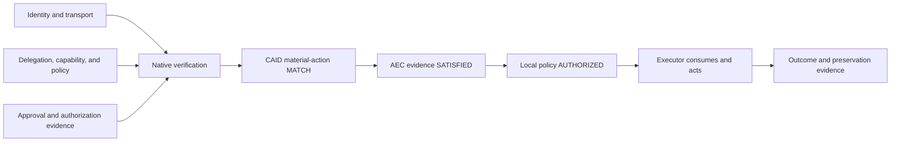

# EMILIA Standards Portfolio

Updated: 2026-07-21

## One story

EMILIA is an evidence architecture for consequential agent actions that cross
administrative boundaries or require delayed, third-party review.

It does not replace transport identity, delegation, machine policy, approval
workflows, or transparency logs. It verifies each artifact under its native
rules, determines whether the artifacts describe the same material action,
and evaluates whether the resulting bundle satisfies a requirement selected by
the relying party.

A single trusted operator with no portable-evidence requirement may not need
this architecture. The motivating case is a remote executor, counterparty,
auditor, insurer, or regulator that did not participate in the original
interaction and cannot simply trust either operator's database.

## Five words that must not collapse

| State | Meaning |
| --- | --- |
| `VERIFIED` | One artifact passed its native verifier under pinned trust inputs. |
| `MATCH` | Verified artifacts denote the same material action, directly or under exact pinned mapping profiles. |
| `SATISFIED` | The verified and matched bundle fills the relying party's evidence requirement. |
| `AUTHORIZED` | The relying party's local policy permits execution. |
| `EXECUTED` | An executor asserts or attests that an effect occurred. |

No transition is automatic. A valid signature does not create authority. A
policy decision is not a human approval. An action match does not validate an
artifact. Satisfied evidence is not proof that an action was lawful, safe,
wise, or correctly executed.

## The layers

1. **Identity and transport** establish who or what is present in the live
   channel. EMILIA consumes WIMSE, SPIFFE, and protocol-native identity rather
   than redefining them.
2. **Delegation, capability, and policy** establish what authority or machine
   policy applies. OAuth, AuthZEN, delegation receipts, and agent transport
   work remain native inputs.
3. **Material action identity and mapping** establish whether different native
   representations denote the same material action. CAID and its
   Action-Mapping Profile own this narrow interface.
4. **Authorization evidence** carries an approval or authorization event under
   a named profile. EMILIA Receipts, Quorum, Mastercard Verifiable Intent, and
   other artifacts can occupy this layer without being treated as
   interchangeable.
5. **Evidence satisfaction** verifies components, checks their action binding,
   and evaluates a relying-party-pinned requirement. AEC returns
   `SATISFIED` or `UNSATISFIED`.
6. **Execution lifecycle** separately handles challenge, enforcement,
   consumption, outcome, revocation, and long-term preservation.

Assurance is expressed as verifier-visible proof predicates, not a universal
letter grade. A relying party may require `user_verified`,
`named_human_bound`, `initiator_excluded`, `distinct_humans >= N`, a maximum
evidence age, and current revocation status. Existing receipt values
`software`, `class_a`, and `quorum` remain profile compatibility aliases; they
do not create a second cross-protocol taxonomy.

The center is intentionally narrow. CAID correlates content; AEC evaluates an
evidence requirement; neither takes the authorization decision away from the
executor.

## The matching claim

Direct digest equality works only when two formats emit identical canonical
content. The CAID Action-Mapping Profile handles the harder case:

- each native artifact verifies first under its own specification;
- the relying party pins the exact source schema/version, target action type,
  type-definition source, and mapping-profile hash;
- every target material field must be mapped with a closed transform set;
- missing, lossy, unknown, or unpinned mappings abstain;
- comparison returns only `EQUIVALENT_UNDER_PROFILE`, `NOT_EQUIVALENT`, or
  `INDETERMINATE`.

This is content correlation, not authorization. The current implementation and
shared vectors are in [`../caid`](../caid).

## Current published line

The July 19 wave established the initial protocol line. On **Tuesday, July 21,
2026**, seven additional or successor revisions were published, and their local
XML sources were verified byte-for-byte against the IETF archive:

1. `draft-schrock-action-evidence-boundary-00`: the explicit boundary between
   independently verified evidence and one material action.
2. `draft-schrock-canonical-action-identifier-01`: current material-action
   identity and profile-bounded matching.
3. `draft-schrock-ep-architecture-02`: current ecosystem map, applicability
   test, and decision vocabulary.
4. `draft-schrock-ep-authorization-evidence-chain-04`: current native
   verification, action binding, and evidence-satisfaction composition.
5. `draft-schrock-ep-authorization-receipts-08`: current organizational
   approval-evidence profile and extension seam.
6. `draft-schrock-ep-revocation-statement-00`: signed retraction of authority
   without rewriting an already executed effect.
7. `draft-schrock-model-to-matter-01`: the current Experimental executor-side
   application profile.

The published line also retains Authority Introduction-01, Quorum-03, Bounded
Capability Receipts-00, and the other current individual drafts listed in
`STATUS.json`. Model-to-Matter remains deliberately separate: publication does
not claim a wet-lab deployment, screening capability, scientific-safety
judgment, physical truth, or external endorsement.

Machine-readable status, including every active individual draft and every
disposition, is in [`STATUS.json`](STATUS.json). A published individual
Internet-Draft is a proposal, not an RFC, a working-group adoption, or IETF
endorsement.

Active successor drafts, review packets, and filing schedules are maintained
outside the public repository. Intentionally public retired sources and
partner-triggered profiles stay here only with an explicit disposition. Public
filing status changes only when a submission is published and its immutable
snapshot is archived here.

## Disposition ledger

These are decisions, not an indefinite waiting room:

| Candidate | Disposition | Canonical owner or trigger |
| --- | --- | --- |
| Assurance Classes | Retired before filing | Verifier-visible proof predicates and profile-local aliases |
| Authority Registry | Retired and absorbed | Authority Introduction-01 |
| Agent Trust Stack | Retired and absorbed | Architecture-02 |
| PQC | Retired as a standalone draft | Evidence Record crypto agility and anti-stripping |
| Model-to-Matter | Published July 19 as an Experimental profile | Name and open executor profile established; deployment claims require a real executor |
| Human Oversight | Partner-triggered profile | A regulator or management-system standards partner validates the mapping |
| Reliance Agreement | Partner-triggered profile | A bank, insurer, or counterparty participates in legal review |

Retired sources remain in `archive/`; the remaining partner-triggered sources
live in `profiles/`. Neither directory is a filing queue.

## Adjacent work

- Linda Dunbar's individual DMSC Agent Gateway gap-analysis draft provides a
  concrete cross-domain enforcement socket; it is not DMSC BoF consensus.
- WIMSE provides live workload identity and channel possession.
- AuthZEN AARP provides requestable denial, asynchronous approval, an approval
  object with optional opaque proof or verifier state, JWS interoperability for
  by-value state, an exact-match baseline, and PDP re-evaluation.
- Mastercard's Verifiable Intent, co-developed with Google and contributed to
  the FIDO Alliance, provides portable evidence of user intent. The cited FIDO
  page describes a contribution and prospective standardization, not a final
  FIDO specification.
- AGTP and related work carry agent messages and authority context.

EMILIA's contribution is compositional: preserve each native verifier, match
material actions explicitly, and let the relying party state the evidence bar.
Where required, an EMILIA profile adds verifier-visible approver-held ceremony,
distinct-human quorum, portable initiator exclusion, and one-time executor
consumption. It does not depend on a claim that adjacent work is missing or
inferior.

## Claim discipline

Public comparisons must cite a named revision and exact text. The 294-document
recon index is for discovery, not proof. Public related-work claims use the
source-locked Observatory corpus. Safe novelty language is "the authors are not
aware of an existing specification providing this composition," followed by
the exact guarantee matrix; never "nobody does this" or "zero rivals."

Eric Rescorla's review sharpened the distinction between ordinary verifier
hygiene and a cross-domain validation requirement. Linda Dunbar's Agent Gateway
scenarios supplied the concrete multi-operator use case. Chris Hood's transport
and composition work helped clarify why evidence needs an action identity that
is independent of any one artifact. These acknowledgments do not imply
endorsement.
