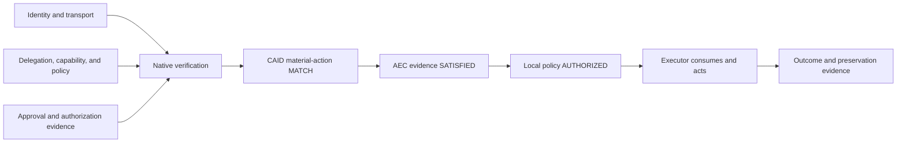

# EMILIA Standards Portfolio

Updated: 2026-08-06

## One story

EMILIA is an evidence architecture for consequential agent actions that cross
administrative boundaries or require delayed, third-party review.

It does not replace transport identity, delegation, machine policy, approval
workflows, or transparency logs. It verifies each artifact under its native
rules, determines whether the artifacts describe the same material action,
and evaluates whether the resulting bundle satisfies a requirement selected by
the relying party.

A single trusted operator with no portable-evidence requirement may not need
this architecture. The motivating case is a remote executor, counterparty,
auditor, insurer, or regulator that did not participate in the original
interaction and cannot simply trust either operator's database.

## Five words that must not collapse

| State | Meaning |
| --- | --- |
| `VERIFIED` | One artifact passed its native verifier under pinned trust inputs. |
| `MATCH` | Verified artifacts denote the same material action, directly or under exact pinned mapping profiles. |
| `SATISFIED` | The verified and matched bundle fills the relying party's evidence requirement. |
| `AUTHORIZED` | The relying party's local policy permits execution. |
| `EXECUTED` | An executor asserts or attests that an effect occurred. |

No transition is automatic. A valid signature does not create authority. A
policy decision is not a human approval. An action match does not validate an
artifact. Satisfied evidence is not proof that an action was lawful, safe,
wise, or correctly executed.

## The layers

1. **Identity and transport** establish who or what is present in the live
   channel. EMILIA consumes WIMSE, SPIFFE, and protocol-native identity rather
   than redefining them.
2. **Delegation, capability, and policy** establish what authority or machine
   policy applies. OAuth, AuthZEN, delegation receipts, and agent transport
   work remain native inputs.
3. **Material action identity and mapping** establish whether different native
   representations denote the same material action. CAID and its
   Action-Mapping Profile own this narrow interface.
4. **Authorization evidence** carries an approval or authorization event under
   a named profile. EMILIA Receipts, Quorum, Mastercard Verifiable Intent, and
   other artifacts can occupy this layer without being treated as
   interchangeable.
5. **Evidence satisfaction** verifies components, checks their action binding,
   and evaluates a relying-party-pinned requirement. AEC returns
   `SATISFIED` or `UNSATISFIED`.
6. **Execution lifecycle** separately handles challenge, enforcement,
   consumption, outcome, revocation, and long-term preservation.

Assurance is expressed as verifier-visible proof predicates, not a universal
letter grade. A relying party may require `user_verified`,
`named_human_bound`, `initiator_excluded`, `distinct_humans >= N`, a maximum
evidence age, and current revocation status. Existing receipt values
`software`, `class_a`, and `quorum` remain profile compatibility aliases; they
do not create a second cross-protocol taxonomy.

```mermaid
flowchart LR
  I["Identity and transport"] --> V["Native verification"]
  D["Delegation, capability, and policy"] --> V
  E["Approval and authorization evidence"] --> V
  V --> M["CAID material-action MATCH"]
  M --> S["AEC evidence SATISFIED"]
  S --> A["Local policy AUTHORIZED"]
  A --> C["Executor consumes and acts"]
  C --> O["Outcome and preservation evidence"]
```

The center is intentionally narrow. CAID correlates content; AEC evaluates an
evidence requirement; neither takes the authorization decision away from the
executor.

## Canonical four-document PRESENTATION surface

For presentation and navigation, the current portfolio has one canonical
four-document surface. It follows the evidence from the approval artifact,
through host-record binding and scoped authority, to relying-party evidence
satisfaction:

1. **Authorization Receipts** —
   [`draft-schrock-ep-authorization-receipts-10`](posted/draft-schrock-ep-authorization-receipts-10.xml)
   defines one action-bound organizational approval-evidence profile and its
   extension seam. Snapshot SHA-256:
   `4800fffb1d03df4aaef95bde97f2cdf9c4e4821b406068c5deca544b5a218d43`.
2. **Human Authorization Binding** —
   [`draft-schrock-human-authorization-binding-00`](posted/draft-schrock-human-authorization-binding-00.xml)
   binds a named-human authorization artifact by value or reference into an
   adjacent host record without redefining either artifact. Snapshot SHA-256:
   `28574a050312837c96189561b2f0776da6cfdb1fe2720dab575fcb99a6811a0e`.
3. **Authority Introduction** —
   [`draft-schrock-ep-authority-introduction-03`](posted/draft-schrock-ep-authority-introduction-03.xml)
   establishes the relying-party-pinned trust root and scoped authority used
   to decide whether a verified key had the relevant authority. Snapshot
   SHA-256:
   `1e9ac4a6b1b480fcec389a6bb42da386d9e394648c1ea6e709b966481247ea9f`.
4. **Authorization Evidence Chain (AEC)** —
   [`draft-schrock-ep-authorization-evidence-chain-05`](posted/draft-schrock-ep-authorization-evidence-chain-05.xml)
   composes natively verified, action-matched evidence against a
   relying-party-pinned requirement and returns `SATISFIED` or `UNSATISFIED`,
   never `AUTHORIZED`. Snapshot SHA-256:
   `1ae4783a0c8e6e68b247191732d8b372c4032416b447a98f0b1040d54faad220`.

This is a presentation surface, not a consolidation or Datatracker
relationship. It does not retire, merge, replace, update, obsolete, or
subordinate any active draft. Every entry in `STATUS.json.active_datatracker`
retains its own scope, revision history, and active status, and the distinct
profile and lifecycle portfolio remains intact.

## Portfolio views that must not collapse

The canonical presentation surface is not the active profile portfolio. The
complete active portfolio remains the 23-entry `STATUS.json.active_datatracker`
inventory, including its distinct evidence profiles and lifecycle drafts; all
20 active `draft-schrock-*` records and all three coauthored records retain their
individual status. Neither presentation order nor appearance in another view
retires, merges, replaces, or demotes an active draft.

Separately, the **runtime execution spine** is:

1. **Architecture-02** defines the system boundaries and non-collapsing
   decision vocabulary.
2. **CAID-02** identifies and matches the exact material action.
3. **AEC-05** verifies and composes action-matched evidence into a relying-party
   satisfaction result.
4. **AEB-03** applies the executor-side admission boundary, including authority
   separation and one-time consequence custody.

This spine names the runtime path; it is not the four-document presentation
surface or a replacement portfolio. AEC appears in both views because evidence
satisfaction feeds runtime admission, not because the views are equivalent.
Exact revisions, source paths, Datatracker URLs, and snapshot digests for both
views are recorded in `STATUS.json`.

## The matching claim

Direct digest equality works only when two formats emit identical canonical
content. The CAID Action-Mapping Profile handles the harder case:

- each native artifact verifies first under its own specification;
- the relying party pins the exact source schema/version, target action type,
  type-definition source, and mapping-profile hash;
- every target material field must be mapped with a closed transform set;
- missing, lossy, unknown, or unpinned mappings abstain;
- comparison returns only `EQUIVALENT_UNDER_PROFILE`, `NOT_EQUIVALENT`, or
  `INDETERMINATE`.

This is content correlation, not authorization. The current implementation and
shared vectors are in [`../caid`](../caid).

## Current published line

The July 19 wave established the initial protocol line. On **Tuesday, July 21,
2026**, seven additional or successor revisions were published, and their local
XML sources were verified byte-for-byte against the IETF archive:

1. `draft-schrock-action-evidence-boundary-00`: the explicit boundary between
   independently verified evidence and one material action.
2. `draft-schrock-canonical-action-identifier-01`: the July 21 material-action
   identity and profile-bounded matching baseline, superseded by -02 on August 6.
3. `draft-schrock-ep-architecture-02`: current ecosystem map, applicability
   test, and decision vocabulary.
4. `draft-schrock-ep-authorization-evidence-chain-04`: current native
   verification, action binding, and evidence-satisfaction composition.
5. `draft-schrock-ep-authorization-receipts-08`: the July 21 organizational
   approval-evidence profile and extension seam, superseded by -09 on August 3.
6. `draft-schrock-ep-revocation-statement-00`: signed retraction of authority
   without rewriting an already executed effect.
7. `draft-schrock-model-to-matter-01`: the July 21 Experimental executor-side
   baseline, superseded by -02 on July 29.

Outcome Binding-00, Model-to-Matter-02, Memory Projection Record-00, AEB-02,
AE Challenge-01, Revocation Statement-01, Authority Introduction-02, Agent
Qualification Statements-00, and Action Remedy Receipts-00 were subsequently
published on July 29-30. Their current XML snapshots are in `posted/`.

On **August 3, 2026**, the following six revisions were published as active
individual Internet-Drafts and verified byte-for-byte against the immutable
IETF archive:

1. AEC-05 adds verifier-derived distinct-subject requirement semantics while
   retaining the boundary between SATISFIED and AUTHORIZED. The new requirement
   member is specified but not yet implemented by the legacy AEC evaluator.
2. AEB-03 makes separation of duties, current status, signed evaluation records,
   and one-time consequence custody explicit boundary terms.
3. Model-to-Matter-03 introduced customer-owned Reliance Programs,
   non-authorizing qualification evidence, and typed AEB admission. The new
   program digests are not yet wired into the reference clearance object.
4. Reliance Agreement-00 defines signed terms and per-action reliance records
   conditioned on evidence sufficiency. Verification is not authorization,
   legal enforceability, insurance issuance, fault allocation, escrow, or
   payment.
5. Bounded Capability Receipts-01 makes parent-funded delegation, aggregate
   sibling conservation, replay fencing, and the one-authoritative-state-domain
   limitation unmistakably normative.
6. Bounded Execution Program-00 defines a signed finite action program whose
   reachability, occurrence ceilings, and aggregate budgets are enforced in the
   same atomic domain as one-time Gate admission.

On **August 6, 2026**, four maintenance revisions were published and verified
byte-for-byte against the immutable IETF archive: CAID-02, Authorization
Receipts-10, Bounded Capability Receipts-02, and Model-to-Matter-04. CAID-02
landed first; Receipts-10 then normatively pinned it. The capability revision
adds explicit shared-state-domain and per-action authorization composition.
Model-to-Matter-04 adds the seventh physical-state attestation role while
preserving the source-claim, not physical-truth, boundary.

The published line also retains Authority Introduction-03, Quorum-03, Bounded
Capability Receipts-02, and the other current individual drafts listed in
`STATUS.json`. Model-to-Matter remains deliberately separate: publication does
not claim a wet-lab deployment, screening capability, scientific-safety
judgment, physical truth, or external endorsement.

Machine-readable status, including every active individual draft and every
disposition, is in [`STATUS.json`](STATUS.json). A published individual
Internet-Draft is a proposal, not an RFC, a working-group adoption, or IETF
endorsement.

The exact submitted-byte packet remains in `staged/UPLOAD-THIS/` as retained
publication provenance, with its checksums and review renders. It is not an
upload queue. Canonical current snapshots are in `posted/`; the IETF archive
remains authoritative for rendered forms and live status.

## New-filing freeze

A 90-day freeze on new Internet-Draft names and `-00` filings is in effect from
2026-08-04 through 2026-11-01, inclusive. Maintenance revisions under an
existing active draft name remain allowed. The only exception requires all of
the following: a wire-level gap, demonstration by a named external implementer
or named external deployment, recorded evidence of that demonstration, and a
recorded overlap review showing that the gap is not already owned by an active
draft or adjacent specification. No active draft is retired or merged by this
freeze, and the distinct active profile portfolio remains intact.

## Disposition ledger

These are decisions, not an indefinite waiting room:

| Candidate | Disposition | Canonical owner or trigger |
| --- | --- | --- |
| Assurance Classes | Retired before filing | Verifier-visible proof predicates and profile-local aliases |
| Authority Registry | Retired and absorbed | Authority Introduction-03 |
| Agent Trust Stack | Retired and absorbed | Architecture-02 |
| PQC | Retired as a standalone draft | Evidence Record crypto agility and anti-stripping |
| Model-to-Matter | Active Experimental profile; current -04 published August 6 | Seven-role clearance, physical-state source claims, and program and requirement digest binding are current; deployment claims require a real executor |
| Human Oversight | Partner-triggered profile | A regulator or management-system standards partner validates the mapping |
| Reliance Agreement | Active individual draft; -00 published August 3 | Narrow signed terms and reliance-event wire format; legal and insurance outcomes remain out of scope |

Retired sources remain in `archive/`; held application profiles live in
`profiles/`. Neither directory is a filing queue.

## Adjacent work

- Linda Dunbar, YiFei Wang, Iman Schrock, and Bing Liu's coauthored DMSC Agent
  Gateway gap-analysis -03 provides a concrete cross-domain enforcement socket;
  it is an active individual draft, not DMSC BoF consensus.
- WIMSE provides live workload identity and channel possession.
- AuthZEN AARP provides requestable denial, asynchronous approval, an approval
  object with optional opaque proof or verifier state, JWS interoperability for
  by-value state, an exact-match baseline, and PDP re-evaluation.
- Mastercard's Verifiable Intent, co-developed with Google and contributed to
  the FIDO Alliance, provides portable evidence of user intent. The cited FIDO
  page describes a contribution and prospective standardization, not a final
  FIDO specification.
- AGTP and related work carry agent messages and authority context.

EMILIA's contribution is compositional: preserve each native verifier, match
material actions explicitly, and let the relying party state the evidence bar.
Where required, an EMILIA profile adds verifier-visible approver-held ceremony,
distinct-human quorum, portable initiator exclusion, and one-time executor
consumption. It does not depend on a claim that adjacent work is missing or
inferior.

## Claim discipline

Public comparisons must cite a named revision and exact text. The 294-document
recon index is for discovery, not proof. Public related-work claims use the
source-locked Observatory corpus. Safe novelty language is "the authors are not
aware of an existing specification providing this composition," followed by
the exact guarantee matrix; never "nobody does this" or "zero rivals."

Eric Rescorla's review sharpened the distinction between ordinary verifier
hygiene and a cross-domain validation requirement. Linda Dunbar's Agent Gateway
scenarios supplied the concrete multi-operator use case. Chris Hood's transport
and composition work helped clarify why evidence needs an action identity that
is independent of any one artifact. These acknowledgments do not imply
endorsement.
